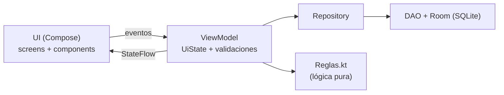
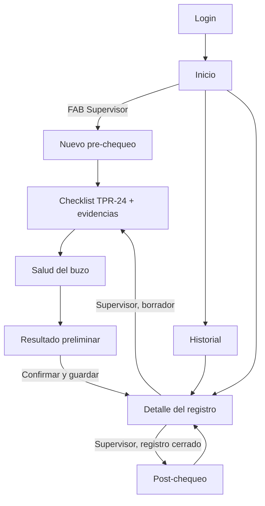

# AquaCheck Buceo — Guía paso a paso

> Guía para construir desde cero una app Android de **pre-chequeo de seguridad para faenas de buceo** con Kotlin, Jetpack Compose, Material 3, MVVM, Navigation y Room.
> Caso académico DSY1105 (AquaChile · Duoc UC CITT). **Todos los datos son ficticios.**

---

## 1. Introducción

**Problemática.** AquaChile realiza cerca de 90 inmersiones diarias y el pre-chequeo sigue siendo "hoja y lápiz": formulario TPR-24, encuesta de salud del buzo, bitácoras y fotos que se suben a una carpeta. Eso dificulta la trazabilidad, depende del factor humano y retrasa detectar condiciones críticas.

**Objetivo.** Digitalizar el pre-chequeo y parte del post-chequeo en una app móvil que funcione en terreno, incluso sin conexión.

**Solución.** Una app con dos roles:

- **Supervisor de buceo:** crea el pre-chequeo, completa el checklist con semáforo, adjunta fotos, registra la salud ficticia del buzo, obtiene un resultado preliminar y registra el post-chequeo.
- **Jefe de centro / Admin:** solo consulta el historial y el detalle.

**Qué aprenderás:** MVVM con `StateFlow`, formularios con validación en el ViewModel, Navigation Compose con argumentos, Room (entidades, DAO, relaciones), cámara y galería sin permisos peligrosos, pruebas unitarias y generación de APK firmado.

> ⚠️ La app es un **apoyo** para el supervisor. No emite autorizaciones reales ni diagnósticos médicos.

## 2. Resultado esperado

Al terminar podrás:

1. Iniciar sesión como `supervisor / 1234` o `admin / 1234`.
2. Crear un pre-chequeo (centro, fecha, hora, buzo) con validación.
3. Evaluar 17 ítems del equipo de buceo intermedio (36 m) con semáforo: **OK / Obs. / No / N/A**.
4. Escribir observaciones obligatorias y adjuntar fotos (cámara o galería).
5. Registrar presión, saturación, pulso y una encuesta preventiva con semáforo en vivo.
6. Ver el resultado preliminar: **Cumple · Observado · Requiere revisión**.
7. Guardar, consultar el historial (con búsqueda y filtros), ver el detalle y registrar el post-chequeo.


### Reglas de negocio (las implementa `Reglas.kt`)

| Situación | Resultado |
|---|---|
| Algún ítem **crítico** en "No cumple" o salud en nivel crítico | 🔴 Requiere revisión |
| Algún ítem observado / no cumple (no crítico) o salud en atención | 🟡 Observado |
| Todo cumple (o N/A) y salud normal | 🟢 Cumple |

Los umbrales de salud (saturación < 92 %, presión ≥ 160/100, etc.) son **ficticios**, solo para el ejercicio.

## 3. Arquitectura



**¿Por qué `MutableStateFlow` privado y `StateFlow` público?** El ViewModel es el único que puede cambiar el estado (`_uiState`); la pantalla solo lo observa (`uiState`). Así el flujo de datos es de una sola dirección y es fácil de depurar y de probar.

```kotlin
private val _uiState = MutableStateFlow(SesionUiState())
val uiState: StateFlow<SesionUiState> = _uiState.asStateFlow()
```

**Room es la fuente de verdad.** Cada pantalla recibe el `id` del registro por navegación y lo carga desde la base de datos; por eso el avance no se pierde al cambiar de pantalla o cerrar la app (requisito de confiabilidad del caso).

## 4. Flujo de navegación



## 5. Tecnologías utilizadas

| Tecnología | Para qué se usa |
|---|---|
| Kotlin + Jetpack Compose | Interfaz declarativa |
| Material 3 | Componentes y tema (paleta AquaCheck) |
| MVVM + StateFlow | Estado de las pantallas |
| Navigation Compose | Navegación con argumentos (`checklist/{id}`) |
| Room (SQLite) | Persistencia local sin conexión |
| Coil | Mostrar las fotos de evidencia |
| `ActivityResultContracts` + `FileProvider` | Cámara y galería (sin permiso `CAMERA`) |
| JUnit + Compose UI Test | Pruebas |

No se usa Retrofit: el caso permite trabajar solo con datos locales y la sincronización queda como desafío (sección 10).

## 6. Estructura final del proyecto

```text
AquaCheck/
├── build.gradle.kts · settings.gradle.kts · gradle.properties
├── gradle/libs.versions.toml
└── app/
    ├── build.gradle.kts
    └── src/
        ├── main/
        │   ├── AndroidManifest.xml
        │   ├── res/ (xml/file_paths.xml, values, drawable, mipmap-anydpi-v26)
        │   └── java/cl/duoc/aquacheck/
        │       ├── MainActivity.kt · AquaCheckApp.kt
        │       ├── model/        Enums · Usuario · PreChequeo · ItemChequeo
        │       ├── data/
        │       │   ├── local/        Converters · PreChequeoDao · AquaCheckDatabase
        │       │   └── repository/   PreChequeoRepository
        │       ├── viewmodel/    SesionViewModel · HistorialViewModel · PreChequeoViewModel
        │       ├── navigation/   AppNavigation
        │       ├── util/         Reglas · DatosDemo · Almacenamiento
        │       └── ui/
        │           ├── theme/        Theme
        │           ├── components/   Semaforo · AquaTopBar · Formulario · RegistroCard · ItemCard
        │           └── screens/      Login · Inicio · Historial · NuevoPreChequeo · Checklist
        │                             Salud · Resultado · Detalle · PostChequeo
        ├── test/         ReglasTest · SesionViewModelTest
        └── androidTest/  LoginScreenTest
```


## 7. Desarrollo paso a paso

Ruta base del código: `app/src/main/java/cl/duoc/aquacheck/` (en esta guía: **`…/aquacheck/`**).

> 💡 Cuando Android Studio marque un símbolo en rojo, pulsa **Alt + Enter** → *Import*. No es necesario copiar los `import` a mano.
> 💡 En cada archivo verás un comentario `// ARCHIVO: …` que explica su propósito. Puedes copiarlo.

| Etapa | Qué construyes | Checkpoint |
|---|---|---|
| 1 | Proyecto base y Gradle | `checkpoint-01-proyecto-base` |
| 2 | Modelos y reglas de negocio | `checkpoint-02-modelos-reglas` |
| 3 | Tema y componentes | `checkpoint-03-tema-componentes` |
| 4 | Room | `checkpoint-04-room` |
| 5 | Login e inicio | `checkpoint-05-login-navegacion` |
| 6 | Nuevo pre-chequeo y checklist | `checkpoint-06-checklist` |
| 7 | Salud del buzo | `checkpoint-07-salud` |
| 8 | Resultado y detalle | `checkpoint-08-resultado-detalle` |
| 9 | Post-chequeo e historial | `checkpoint-09-integracion` |
| 10 | Pruebas | `checkpoint-10-testing` |
| 11 | Generar el APK | `checkpoint-11-apk` |

Después de cada etapa haz un commit con `git add . && git commit -m "checkpoint-0X-..."`. Si algo se rompe, vuelve al checkpoint anterior.

---

### Etapa 1 — Crear el proyecto base

#### Objetivo
Tener un proyecto Compose vacío, con todas las dependencias, que compile y muestre una pantalla.

#### Archivos
`gradle/libs.versions.toml`, `gradle.properties`, `app/build.gradle.kts`, `AndroidManifest.xml`, recursos y `MainActivity.kt`.

#### Paso 1 — Crear el proyecto
En Android Studio: **New Project → Empty Activity** (la de Compose). Nombre `AquaCheck`, paquete `cl.duoc.aquacheck`, *Minimum SDK* **API 26**, lenguaje Kotlin y *Build configuration language* **Kotlin DSL**.

En *Settings → Build Tools → Gradle* deja **Gradle JDK = jbr (embedded JDK)** de Android Studio.

#### Paso 2 — Catálogo de versiones
Reemplaza el contenido de `gradle/libs.versions.toml`. Aquí viven **todas** las versiones en un solo lugar:

```toml
[versions]
agp = "9.4.1"
kotlin = "2.3.0"
ksp = "2.3.12"
composeBom = "2026.09.00"
coreKtx = "1.19.1"
activityCompose = "1.13.0"
lifecycle = "2.11.0"
navigation = "2.10.2"
room = "2.8.5"
coil = "2.7.0"
coroutines = "1.11.0"
junit = "4.13.2"
androidxTestExt = "1.3.0"

[libraries]
androidx-core-ktx = { group = "androidx.core", name = "core-ktx", version.ref = "coreKtx" }
androidx-activity-compose = { group = "androidx.activity", name = "activity-compose", version.ref = "activityCompose" }
androidx-lifecycle-viewmodel-compose = { group = "androidx.lifecycle", name = "lifecycle-viewmodel-compose", version.ref = "lifecycle" }
androidx-lifecycle-runtime-compose = { group = "androidx.lifecycle", name = "lifecycle-runtime-compose", version.ref = "lifecycle" }
androidx-navigation-compose = { group = "androidx.navigation", name = "navigation-compose", version.ref = "navigation" }
androidx-compose-bom = { group = "androidx.compose", name = "compose-bom", version.ref = "composeBom" }
androidx-compose-ui = { group = "androidx.compose.ui", name = "ui" }
androidx-compose-ui-tooling-preview = { group = "androidx.compose.ui", name = "ui-tooling-preview" }
androidx-compose-ui-tooling = { group = "androidx.compose.ui", name = "ui-tooling" }
androidx-compose-ui-test-junit4 = { group = "androidx.compose.ui", name = "ui-test-junit4" }
androidx-compose-ui-test-manifest = { group = "androidx.compose.ui", name = "ui-test-manifest" }
androidx-compose-material3 = { group = "androidx.compose.material3", name = "material3" }
androidx-compose-material-icons-extended = { group = "androidx.compose.material", name = "material-icons-extended" }
androidx-room-runtime = { group = "androidx.room", name = "room-runtime", version.ref = "room" }
androidx-room-ktx = { group = "androidx.room", name = "room-ktx", version.ref = "room" }
androidx-room-compiler = { group = "androidx.room", name = "room-compiler", version.ref = "room" }
coil-compose = { group = "io.coil-kt", name = "coil-compose", version.ref = "coil" }
kotlinx-coroutines-test = { group = "org.jetbrains.kotlinx", name = "kotlinx-coroutines-test", version.ref = "coroutines" }
junit = { group = "junit", name = "junit", version.ref = "junit" }
androidx-test-ext-junit = { group = "androidx.test.ext", name = "junit", version.ref = "androidxTestExt" }

[plugins]
android-application = { id = "com.android.application", version.ref = "agp" }
kotlin-compose = { id = "org.jetbrains.kotlin.plugin.compose", version.ref = "kotlin" }
ksp = { id = "com.google.devtools.ksp", version.ref = "ksp" }
```

> Si tu Android Studio es más antiguo y Gradle se queja de la versión del plugin, baja `agp` a la versión que te sugiera el asistente (menú *Tools → AGP Upgrade Assistant*) y ajusta `distributionUrl` en `gradle/wrapper/gradle-wrapper.properties`.

#### Paso 3 — Propiedades de Gradle

```properties
org.gradle.jvmargs=-Xmx2048m -Dfile.encoding=UTF-8
android.useAndroidX=true
android.nonTransitiveRClass=true
kotlin.code.style=official
```

#### Paso 4 — Gradle del módulo
Reemplaza `app/build.gradle.kts`. Y en el archivo **raíz** `build.gradle.kts` deja solo los plugins con `apply false`.

```kotlin
import java.util.Properties
import org.jetbrains.kotlin.gradle.dsl.JvmTarget

plugins {
    alias(libs.plugins.android.application)
    alias(libs.plugins.kotlin.compose)
    alias(libs.plugins.ksp)
}

// Datos de firma opcionales (archivo keystore.properties en la raíz, fuera de git)
val keystoreProps = Properties().apply {
    val archivo = rootProject.file("keystore.properties")
    if (archivo.exists()) archivo.inputStream().use { load(it) }
}

android {
    namespace = "cl.duoc.aquacheck"
    compileSdk = 37

    defaultConfig {
        applicationId = "cl.duoc.aquacheck"
        minSdk = 26
        targetSdk = 36
        versionCode = 1
        versionName = "1.0"
        testInstrumentationRunner = "androidx.test.runner.AndroidJUnitRunner"
    }

    signingConfigs {
        create("release") {
            if (keystoreProps.isNotEmpty()) {
                storeFile = rootProject.file(keystoreProps.getProperty("storeFile"))
                storePassword = keystoreProps.getProperty("storePassword")
                keyAlias = keystoreProps.getProperty("keyAlias")
                keyPassword = keystoreProps.getProperty("keyPassword")
            }
        }
    }

    buildTypes {
        release {
            isMinifyEnabled = false
            if (keystoreProps.isNotEmpty()) {
                signingConfig = signingConfigs.getByName("release")
            }
        }
    }

    compileOptions {
        sourceCompatibility = JavaVersion.VERSION_17
        targetCompatibility = JavaVersion.VERSION_17
    }
    buildFeatures {
        compose = true
    }
    packaging {
        resources.excludes += "/META-INF/{AL2.0,LGPL2.1}"
    }
}

kotlin {
    compilerOptions { jvmTarget.set(JvmTarget.JVM_17) }
}

dependencies {
    implementation(libs.androidx.core.ktx)
    implementation(libs.androidx.activity.compose)
    implementation(libs.androidx.lifecycle.viewmodel.compose)
    implementation(libs.androidx.lifecycle.runtime.compose)
    implementation(libs.androidx.navigation.compose)

    implementation(platform(libs.androidx.compose.bom))
    implementation(libs.androidx.compose.ui)
    implementation(libs.androidx.compose.ui.tooling.preview)
    implementation(libs.androidx.compose.material3)
    implementation(libs.androidx.compose.material.icons.extended)

    implementation(libs.androidx.room.runtime)
    implementation(libs.androidx.room.ktx)
    ksp(libs.androidx.room.compiler)

    implementation(libs.coil.compose)

    testImplementation(libs.junit)
    testImplementation(libs.kotlinx.coroutines.test)

    androidTestImplementation(platform(libs.androidx.compose.bom))
    androidTestImplementation(libs.androidx.test.ext.junit)
    androidTestImplementation(libs.androidx.compose.ui.test.junit4)
    debugImplementation(libs.androidx.compose.ui.tooling)
    debugImplementation(libs.androidx.compose.ui.test.manifest)
}
```

```kotlin
// Archivo raíz: solo declara los plugins; se aplican en app/build.gradle.kts
plugins {
    alias(libs.plugins.android.application) apply false
    alias(libs.plugins.kotlin.compose) apply false
    alias(libs.plugins.ksp) apply false
}
```

#### Paso 5 — Manifest y recursos
`app/src/main/AndroidManifest.xml` (la línea `android:name=".AquaCheckApp"` la agregarás en la etapa 4):

```xml
<?xml version="1.0" encoding="utf-8"?>
<manifest xmlns:android="http://schemas.android.com/apk/res/android">

    <!-- La cámara es opcional: la app también permite elegir fotos de la galería.
         No se declara el permiso CAMERA porque usamos la app de cámara del sistema. -->
    <uses-feature
        android:name="android.hardware.camera"
        android:required="false" />

    <application
        android:allowBackup="false"
        android:icon="@mipmap/ic_launcher"
        android:roundIcon="@mipmap/ic_launcher_round"
        android:label="@string/app_name"
        android:supportsRtl="true"
        android:theme="@style/Theme.AquaCheck">

        <activity
            android:name=".MainActivity"
            android:exported="true">
            <intent-filter>
                <action android:name="android.intent.action.MAIN" />
                <category android:name="android.intent.category.LAUNCHER" />
            </intent-filter>
        </activity>

        <!-- Permite que la app de cámara escriba la foto en nuestro almacenamiento -->
        <provider
            android:name="androidx.core.content.FileProvider"
            android:authorities="${applicationId}.fileprovider"
            android:exported="false"
            android:grantUriPermissions="true">
            <meta-data
                android:name="android.support.FILE_PROVIDER_PATHS"
                android:resource="@xml/file_paths" />
        </provider>
    </application>
</manifest>
```

Crea `res/xml/file_paths.xml` (permite que la cámara guarde fotos en la carpeta privada de la app):

```xml
<?xml version="1.0" encoding="utf-8"?>
<paths>
    <files-path name="evidencias" path="evidencias/" />
</paths>
```

Reemplaza `res/values/themes.xml`, `colors.xml` y `strings.xml`:

```xml
<?xml version="1.0" encoding="utf-8"?>
<resources>
    <!-- Tema XML mínimo: todo el diseño real vive en Compose (ui/theme) -->
    <style name="Theme.AquaCheck" parent="android:Theme.Material.Light.NoActionBar">
        <item name="android:windowBackground">@color/fondo</item>
    </style>
</resources>
```

```xml
<?xml version="1.0" encoding="utf-8"?>
<resources>
    <color name="ic_launcher_background">#0B3D62</color>
    <color name="fondo">#F3F7F9</color>
</resources>
```

```xml
<resources>
    <string name="app_name">AquaCheck</string>
</resources>
```

#### Paso 6 — Ícono de la app
Crea `res/drawable/ic_launcher_foreground.xml` (ola + check) y los dos archivos de `res/mipmap-anydpi-v26/` (`ic_launcher.xml` e `ic_launcher_round.xml`, idénticos):

```xml
<?xml version="1.0" encoding="utf-8"?>
<vector xmlns:android="http://schemas.android.com/apk/res/android"
    android:width="108dp"
    android:height="108dp"
    android:viewportWidth="108"
    android:viewportHeight="108">
    <!-- Ola -->
    <path
        android:fillColor="#00A3C4"
        android:pathData="M30,68 Q42,56 54,68 T78,68 L78,76 Q66,64 54,76 T30,76 Z" />
    <!-- Check -->
    <path
        android:fillColor="#00000000"
        android:pathData="M36,40 L48,52 L72,28"
        android:strokeColor="#FFFFFF"
        android:strokeLineCap="round"
        android:strokeLineJoin="round"
        android:strokeWidth="7" />
</vector>
```

```xml
<?xml version="1.0" encoding="utf-8"?>
<adaptive-icon xmlns:android="http://schemas.android.com/apk/res/android">
    <background android:drawable="@color/ic_launcher_background" />
    <foreground android:drawable="@drawable/ic_launcher_foreground" />
</adaptive-icon>
```

Borra los íconos `.webp` antiguos de `mipmap-*` si el asistente los creó.

#### Paso 7 — MainActivity temporal
Por ahora `MainActivity.kt` solo muestra un texto (la versión final llega en la etapa 5):

```kotlin
package cl.duoc.aquacheck

import android.os.Bundle
import androidx.activity.ComponentActivity
import androidx.activity.compose.setContent
import androidx.compose.material3.Text

class MainActivity : ComponentActivity() {
    override fun onCreate(savedInstanceState: Bundle?) {
        super.onCreate(savedInstanceState)
        setContent { Text("Hola AquaCheck") }
    }
}
```

Pulsa **Sync Now** y ejecuta la app (▶).

#### Explicación
- `libs.versions.toml` evita repetir versiones; en `build.gradle.kts` las usas como `libs.androidx.room.runtime`.
- `ksp` procesa las anotaciones de Room en tiempo de compilación.
- El `FileProvider` es la forma segura de darle a la app de cámara un lugar donde escribir.
- **No** declaramos el permiso `CAMERA`: usamos la cámara del sistema (`TakePicture`), que no lo requiere.

#### Resultado esperado
La app abre y muestra "Hola AquaCheck".

#### Verificación
- [ ] *Sync* termina sin errores.
- [ ] La app compila y se ejecuta.
- [ ] Aparece el texto de prueba y el ícono nuevo.

#### Error frecuente
- *"Unsupported class file major version"* → Gradle está usando un JDK demasiado nuevo o viejo. Usa el JDK embebido de Android Studio.
- *"Unable to delete directory … build"* → el proyecto está en una carpeta sincronizada con **OneDrive**. Muévelo a una ruta como `C:\proyectos\AquaCheck`.
- Con AGP 9 ya **no** se aplica el plugin `kotlin.android`: Kotlin viene integrado. Por eso solo vemos `kotlin.compose` y `ksp` en los plugins.

**Checkpoint:** `git init && git add . && git commit -m "checkpoint-01-proyecto-base"`

---

### Etapa 2 — Modelos y reglas de negocio

#### Objetivo
Definir los datos (entidades) y las reglas que deciden el resultado, **sin pantallas todavía**.

#### Archivos
`…/aquacheck/model/` (4 archivos), `…/util/DatosDemo.kt`, `…/util/Reglas.kt`.

#### Paso 1 — Enumeraciones
`model/Enums.kt`: estados del ítem, resultado, nivel de salud y rol.

```kotlin
package cl.duoc.aquacheck.model

// ARCHIVO: Enumeraciones del dominio: estado de ítem, resultado, nivel de salud y rol.

/** Estado de cada ítem del checklist. PENDIENTE = aún no evaluado. */
enum class EstadoItem(val etiqueta: String) {
    PENDIENTE("Pendiente"),
    CUMPLE("Cumple"),
    OBSERVADO("Observado"),
    NO_CUMPLE("No cumple"),
    NO_APLICA("No aplica")
}

/** Resultado preliminar del pre-chequeo (el semáforo general). */
enum class Resultado(val etiqueta: String) {
    CUMPLE("Cumple"),
    OBSERVADO("Observado"),
    REQUIERE_REVISION("Requiere revisión")
}

/** Nivel de los parámetros de salud ficticios. */
enum class NivelSalud(val etiqueta: String) {
    OK("Normal"),
    ALERTA("Atención"),
    CRITICO("Crítico")
}

enum class Rol(val etiqueta: String) {
    SUPERVISOR("Supervisor de buceo"),
    ADMIN("Jefe de centro / Admin")
}
```

#### Paso 2 — Usuario, PreChequeo e ItemChequeo
`model/Usuario.kt`:

```kotlin
package cl.duoc.aquacheck.model

// ARCHIVO: Modelo de usuario ficticio para el login.

/** Usuario ficticio de prueba. En un sistema real vendría de un backend. */
data class Usuario(
    val nombre: String,
    val usuario: String,
    val clave: String,
    val rol: Rol
)
```

`model/PreChequeo.kt` — un solo registro guarda todo el proceso:

```kotlin
package cl.duoc.aquacheck.model

// ARCHIVO: Entidad Room: registro completo de un pre-chequeo (faena, salud, resultado, post-chequeo).

import androidx.room.Entity
import androidx.room.PrimaryKey

/**
 * Un registro de pre-chequeo. Un solo registro guarda todo el proceso:
 * datos de la faena, parámetros de salud ficticios, resultado y post-chequeo.
 */
@Entity(tableName = "pre_chequeos")
data class PreChequeo(
    @PrimaryKey(autoGenerate = true) val id: Long = 0,

    // Datos de la faena
    val centro: String,
    val fecha: String,      // dd-MM-aaaa
    val hora: String,       // HH:mm
    val buzo: String,
    val supervisor: String,

    // Salud ficticia (se completa en la pantalla de salud)
    val saludRegistrada: Boolean = false,
    val sistolica: Int? = null,
    val diastolica: Int? = null,
    val saturacion: Int? = null,
    val pulso: Int? = null,
    val sintomas: Boolean = false,
    val malDescanso: Boolean = false,
    val medicamentos: Boolean = false,

    // Cierre del pre-chequeo
    val resultado: Resultado? = null,
    val cerrado: Boolean = false,

    // Post-chequeo
    val postCompletado: Boolean = false,
    val postCondicion: String = "",
    val postSaturacion: Int? = null,
    val postObservacion: String = ""
)
```

`model/ItemChequeo.kt` — cada pre-chequeo tiene muchos ítems (`ForeignKey` con `CASCADE`):

```kotlin
package cl.duoc.aquacheck.model

// ARCHIVO: Entidad Room: un ítem del checklist TPR-24 con estado, observación y foto.

import androidx.room.Entity
import androidx.room.ForeignKey
import androidx.room.Index
import androidx.room.PrimaryKey

/** Un ítem del checklist TPR-24 asociado a un pre-chequeo. */
@Entity(
    tableName = "items_chequeo",
    foreignKeys = [ForeignKey(
        entity = PreChequeo::class,
        parentColumns = ["id"],
        childColumns = ["preChequeoId"],
        onDelete = ForeignKey.CASCADE   // al borrar el pre-chequeo se borran sus ítems
    )],
    indices = [Index("preChequeoId")]
)
data class ItemChequeo(
    @PrimaryKey(autoGenerate = true) val id: Long = 0,
    val preChequeoId: Long,
    val categoria: String,
    val nombre: String,
    val critico: Boolean,
    val estado: EstadoItem = EstadoItem.PENDIENTE,
    val observacion: String = "",
    val fotoUri: String = ""
)
```

#### Paso 3 — Datos ficticios y plantilla del checklist
`util/DatosDemo.kt`. La plantilla sale del listado de equipamiento de buceo intermedio de la presentación del cliente:

```kotlin
package cl.duoc.aquacheck.util

// ARCHIVO: Plantilla del checklist y datos ficticios (centros, buzos, usuarios).

import cl.duoc.aquacheck.model.Rol
import cl.duoc.aquacheck.model.Usuario

/** Un ítem de la plantilla del checklist (basado en equipo de buceo intermedio, 36 m). */
data class PlantillaItem(val categoria: String, val nombre: String, val critico: Boolean = false)

object ChecklistBase {
    private const val EQUIPO = "Equipamiento del buzo"
    private const val AIRE = "Compresor y suministro de aire"
    private const val EMERGENCIA = "Emergencia"
    private const val ENTORNO = "Entorno y señalización"

    val items = listOf(
        PlantillaItem(EQUIPO, "Máscara facial con comunicaciones", critico = true),
        PlantillaItem(EQUIPO, "Regulador", critico = true),
        PlantillaItem(EQUIPO, "Botella de emergencia", critico = true),
        PlantillaItem(EQUIPO, "Arnés de escape rápido", critico = true),
        PlantillaItem(EQUIPO, "Cinturón de lastro con hebilla de escape", critico = true),
        PlantillaItem(EQUIPO, "Umbilical (aire + comunicaciones)", critico = true),
        PlantillaItem(EQUIPO, "Profundímetro y reloj de buceo"),
        PlantillaItem(EQUIPO, "Traje, aletas y cuchillo"),
        PlantillaItem(AIRE, "Compresor operativo", critico = true),
        PlantillaItem(AIRE, "Filtros Kaeser en buen estado", critico = true),
        PlantillaItem(AIRE, "Filtros de toma de aire del compresor"),
        PlantillaItem(AIRE, "Consola / manifold"),
        PlantillaItem(EMERGENCIA, "Buzo de emergencia disponible y equipado", critico = true),
        PlantillaItem(EMERGENCIA, "Oxígeno de contingencia disponible", critico = true),
        PlantillaItem(ENTORNO, "Señalización visible para embarcaciones", critico = true),
        PlantillaItem(ENTORNO, "Comunicaciones probadas"),
        PlantillaItem(ENTORNO, "Condiciones del mar y clima aptas")
    )
}

/** Datos ficticios para probar la app (no usar datos reales de personas). */
object DatosDemo {
    val centros = listOf("Centro Demo Calbuco", "Centro Demo Puerto Montt", "Centro Demo Chiloé")
    val buzos = listOf("Buzo Demo 01", "Buzo Demo 02", "Buzo Demo 03", "Buzo Demo 04")
    val usuarios = listOf(
        Usuario("Supervisor Demo", "supervisor", "1234", Rol.SUPERVISOR),
        Usuario("Jefe de Centro Demo", "admin", "1234", Rol.ADMIN)
    )
}
```

#### Paso 4 — Reglas (en cuatro partes)
Crea `util/Reglas.kt` como `object Reglas { … }` y agrega estas partes **dentro** del objeto. Primero fechas y formulario:

```kotlin
object Reglas {

    val FORMATO_FECHA: DateTimeFormatter =
        DateTimeFormatter.ofPattern("dd-MM-uuuu").withResolverStyle(ResolverStyle.STRICT)
    private val FORMATO_HORA = DateTimeFormatter.ofPattern("HH:mm")

    fun fechaHoy(): String = LocalDate.now().format(FORMATO_FECHA)
    fun horaAhora(): String = LocalTime.now().format(FORMATO_HORA)
```

```kotlin
    fun validarFormulario(centro: String, fecha: String, hora: String, buzo: String): Map<String, String> {
        val errores = mutableMapOf<String, String>()
        if (centro.isBlank()) errores["centro"] = "Selecciona un centro"
        if (buzo.isBlank()) errores["buzo"] = "Selecciona un buzo"
        if (!fechaValida(fecha)) errores["fecha"] = "Usa el formato dd-MM-aaaa (ej. 15-10-2026)"
        if (!horaValida(hora)) errores["hora"] = "Usa el formato HH:mm (ej. 08:30)"
        return errores
    }

    private fun fechaValida(texto: String) =
        try { LocalDate.parse(texto, FORMATO_FECHA); true } catch (e: DateTimeParseException) { false }

    private fun horaValida(texto: String) =
        try { LocalTime.parse(texto, FORMATO_HORA); true } catch (e: DateTimeParseException) { false }
```

Validación y semáforo de salud:

```kotlin
    fun validarSalud(sistolica: String, diastolica: String, saturacion: String, pulso: String): Map<String, String> {
        val errores = mutableMapOf<String, String>()
        rango(sistolica, 70, 250, "mmHg")?.let { errores["sistolica"] = it }
        rango(diastolica, 40, 150, "mmHg")?.let { errores["diastolica"] = it }
        rango(saturacion, 50, 100, "%")?.let { errores["saturacion"] = it }
        rango(pulso, 30, 220, "lat/min")?.let { errores["pulso"] = it }
        val s = sistolica.toIntOrNull()
        val d = diastolica.toIntOrNull()
        if (s != null && d != null && d >= s && "diastolica" !in errores) {
            errores["diastolica"] = "Debe ser menor que la sistólica"
        }
        return errores
    }

    private fun rango(texto: String, min: Int, max: Int, unidad: String): String? {
        val n = texto.trim().toIntOrNull() ?: return "Ingresa un número"
        return if (n in min..max) null else "Debe estar entre $min y $max $unidad"
    }

    fun nivelSalud(
        sistolica: Int, diastolica: Int, saturacion: Int, pulso: Int,
        sintomas: Boolean, malDescanso: Boolean, medicamentos: Boolean
    ): NivelSalud {
        val critico = saturacion < 92 || sistolica >= 160 || diastolica >= 100 ||
            pulso < 45 || pulso > 120 || sintomas
        if (critico) return NivelSalud.CRITICO
        val alerta = saturacion < 95 || sistolica >= 140 || diastolica >= 90 ||
            pulso < 55 || pulso > 100 || malDescanso || medicamentos
        return if (alerta) NivelSalud.ALERTA else NivelSalud.OK
    }

    /** Nivel de salud de un registro, o null si aún no se registró la salud. */
    fun nivelDe(p: PreChequeo): NivelSalud? {
        if (!p.saludRegistrada) return null
        return nivelSalud(
            p.sistolica ?: return null, p.diastolica ?: return null,
            p.saturacion ?: return null, p.pulso ?: return null,
            p.sintomas, p.malDescanso, p.medicamentos
        )
    }
```

Checklist y resultado preliminar:

```kotlin
    /** Devuelve el primer problema que impide continuar, o null si el checklist está completo. */
    fun errorChecklist(items: List<ItemChequeo>): String? {
        val pendientes = items.count { it.estado == EstadoItem.PENDIENTE }
        if (pendientes > 0) return "Faltan $pendientes ítems por evaluar"
        val sinObservacion = items.firstOrNull {
            (it.estado == EstadoItem.OBSERVADO || it.estado == EstadoItem.NO_CUMPLE) &&
                it.observacion.trim().length < 5
        }
        if (sinObservacion != null) {
            return "Escribe una observación (mín. 5 letras) en: ${sinObservacion.nombre}"
        }
        return null
    }

    fun calcularResultado(items: List<ItemChequeo>, salud: NivelSalud?): Resultado {
        val falloCritico = items.any { it.critico && it.estado == EstadoItem.NO_CUMPLE }
        if (falloCritico || salud == NivelSalud.CRITICO) return Resultado.REQUIERE_REVISION
        val hayObservaciones = items.any {
            it.estado == EstadoItem.OBSERVADO || it.estado == EstadoItem.NO_CUMPLE
        } || salud == NivelSalud.ALERTA
        return if (hayObservaciones) Resultado.OBSERVADO else Resultado.CUMPLE
    }

    fun alertas(items: List<ItemChequeo>, salud: NivelSalud?): List<String> {
        val lista = mutableListOf<String>()
        items.filter { it.estado == EstadoItem.NO_CUMPLE }.forEach {
            lista += "No cumple${if (it.critico) " (crítico)" else ""}: ${it.nombre}"
        }
        items.filter { it.estado == EstadoItem.OBSERVADO }.forEach { lista += "Observado: ${it.nombre}" }
        when (salud) {
            NivelSalud.CRITICO -> lista += "Salud: parámetros en rango crítico"
            NivelSalud.ALERTA -> lista += "Salud: parámetros que requieren atención"
            else -> Unit
        }
        return lista
    }
```

Post-chequeo y cierre del objeto con `}`:

```kotlin
    val CONDICIONES_POST = listOf("Sin novedad", "Molestias leves", "Requiere atención")

    fun validarPost(condicion: String, saturacion: String, observacion: String): Map<String, String> {
        val errores = mutableMapOf<String, String>()
        if (condicion.isBlank()) errores["condicion"] = "Selecciona la condición final"
        if (saturacion.isNotBlank()) rango(saturacion, 50, 100, "%")?.let { errores["saturacion"] = it }
        if (condicion.isNotBlank() && condicion != CONDICIONES_POST.first() && observacion.trim().length < 5) {
            errores["observacion"] = "Describe lo ocurrido (mín. 5 letras)"
        }
        return errores
    }
```

```kotlin
}
```

#### Explicación
- `Reglas` son **funciones puras**: no usan Android, así que se prueban con JUnit en milisegundos (etapa 10).
- `validarFormulario` devuelve un `Map<campo, mensaje>`; si está vacío, no hay errores. La UI solo muestra esos mensajes.
- `calcularResultado` implementa la tabla de la sección 2.

#### Resultado esperado
Sin cambios visibles: la app compila igual. Es la base lógica.

#### Verificación
- [ ] Todo compila.
- [ ] `ItemChequeo` referencia a `PreChequeo` con `ForeignKey`.
- [ ] Puedes explicar por qué `Reglas` no depende de Android.

**Checkpoint:** `checkpoint-02-modelos-reglas`

---

### Etapa 3 — Tema y componentes reutilizables

#### Objetivo
Aplicar la identidad visual (paleta de la Clase 2) y crear piezas de UI que usarán todas las pantallas.

#### Archivos
`ui/theme/Theme.kt`, `ui/components/` (5 archivos).

| Rol | Color | Uso |
|---|---|---|
| Principal | `#0B3D62` | Barras, botones |
| Secundario | `#00A3C4` | Acentos, degradado |
| Fondo | `#F3F7F9` | Fondo de pantallas |
| Verde / Ámbar / Rojo | `#17A75A` / `#D98A00` / `#DE3B40` | Semáforo |

#### Paso 1 — Tema
`ui/theme/Theme.kt` define colores, formas redondeadas y el degradado de marca:

```kotlin
package cl.duoc.aquacheck.ui.theme

// ARCHIVO: Tema Material 3: paleta AquaCheck, formas redondeadas y degradado de marca.

import androidx.compose.foundation.shape.RoundedCornerShape
import androidx.compose.material3.MaterialTheme
import androidx.compose.material3.Shapes
import androidx.compose.material3.lightColorScheme
import androidx.compose.runtime.Composable
import androidx.compose.ui.graphics.Brush
import androidx.compose.ui.graphics.Color
import androidx.compose.ui.unit.dp

// Paleta definida en la Clase 2 (identidad visual AquaCheck)
val AzulProfundo = Color(0xFF0B3D62)
val Celeste = Color(0xFF00A3C4)
val Fondo = Color(0xFFF3F7F9)
val TextoOscuro = Color(0xFF0F2430)

// Colores del semáforo
val Verde = Color(0xFF17A75A)
val Ambar = Color(0xFFD98A00)
val Rojo = Color(0xFFDE3B40)
val Gris = Color(0xFF6B7C86)

private val Esquema = lightColorScheme(
    primary = AzulProfundo,
    onPrimary = Color.White,
    primaryContainer = Color(0xFFD6E8F4),
    onPrimaryContainer = AzulProfundo,
    secondary = Celeste,
    onSecondary = TextoOscuro,
    background = Fondo,
    onBackground = TextoOscuro,
    surface = Color.White,
    onSurface = TextoOscuro,
    surfaceVariant = Color(0xFFE3ECF1),
    onSurfaceVariant = Color(0xFF3A4F5C),
    error = Rojo,
    onError = Color.White,
    // Tarjetas blancas sobre fondo gris azulado, barra inferior blanca y selección celeste suave
    surfaceContainerHighest = Color.White,
    surfaceContainer = Color.White,
    secondaryContainer = Color(0xFFCDEFF7),
    onSecondaryContainer = AzulProfundo,
    outlineVariant = Color(0xFFD3E0E7)
)

private val Formas = Shapes(
    small = RoundedCornerShape(10.dp),
    medium = RoundedCornerShape(16.dp),
    large = RoundedCornerShape(24.dp)
)

/** Degradado de marca (superficie → profundidad) usado en cabeceras. */
val DegradadoMarca = Brush.linearGradient(listOf(AzulProfundo, Color(0xFF0E6A94), Celeste))

@Composable
fun AquaCheckTheme(content: @Composable () -> Unit) {
    MaterialTheme(colorScheme = Esquema, shapes = Formas, content = content)
}
```

#### Paso 2 — Semáforo y barra superior
`ui/components/Semaforo.kt` asocia cada estado con un color:

```kotlin
package cl.duoc.aquacheck.ui.components

// ARCHIVO: Colores del semáforo (verde, ámbar, rojo) y etiqueta Insignia.

import androidx.compose.foundation.layout.padding
import androidx.compose.foundation.shape.RoundedCornerShape
import androidx.compose.material3.MaterialTheme
import androidx.compose.material3.Surface
import androidx.compose.material3.Text
import androidx.compose.runtime.Composable
import androidx.compose.ui.Modifier
import androidx.compose.ui.graphics.Color
import androidx.compose.ui.text.font.FontWeight
import androidx.compose.ui.unit.dp
import cl.duoc.aquacheck.model.EstadoItem
import cl.duoc.aquacheck.model.NivelSalud
import cl.duoc.aquacheck.model.Resultado
import cl.duoc.aquacheck.ui.theme.Ambar
import cl.duoc.aquacheck.ui.theme.Gris
import cl.duoc.aquacheck.ui.theme.Rojo
import cl.duoc.aquacheck.ui.theme.Verde

fun EstadoItem.color(): Color = when (this) {
    EstadoItem.CUMPLE -> Verde
    EstadoItem.OBSERVADO -> Ambar
    EstadoItem.NO_CUMPLE -> Rojo
    EstadoItem.NO_APLICA -> Gris
    EstadoItem.PENDIENTE -> Gris
}

fun Resultado.color(): Color = when (this) {
    Resultado.CUMPLE -> Verde
    Resultado.OBSERVADO -> Ambar
    Resultado.REQUIERE_REVISION -> Rojo
}

fun NivelSalud.color(): Color = when (this) {
    NivelSalud.OK -> Verde
    NivelSalud.ALERTA -> Ambar
    NivelSalud.CRITICO -> Rojo
}

/** Etiqueta pequeña con color de fondo suave (para estados y resultados). */
@Composable
fun Insignia(texto: String, color: Color, modifier: Modifier = Modifier) {
    Surface(
        modifier = modifier,
        color = color.copy(alpha = 0.15f),
        shape = RoundedCornerShape(50)
    ) {
        Text(
            text = texto,
            color = color,
            style = MaterialTheme.typography.labelLarge,
            fontWeight = FontWeight.Bold,
            modifier = Modifier.padding(horizontal = 10.dp, vertical = 4.dp)
        )
    }
}
```

`ui/components/AquaTopBar.kt` — el `@OptIn` de la API experimental queda en **un solo lugar**:

```kotlin
package cl.duoc.aquacheck.ui.components

// ARCHIVO: Barra superior reutilizable con botón volver y acciones.

import androidx.compose.foundation.layout.RowScope
import androidx.compose.material.icons.Icons
import androidx.compose.material.icons.automirrored.filled.ArrowBack
import androidx.compose.material3.ExperimentalMaterial3Api
import androidx.compose.material3.Icon
import androidx.compose.material3.IconButton
import androidx.compose.material3.Text
import androidx.compose.material3.TopAppBar
import androidx.compose.material3.TopAppBarDefaults
import androidx.compose.runtime.Composable
import androidx.compose.ui.graphics.Color

/** Barra superior común. El @OptIn queda aquí, en un solo lugar, y el resto de la app no lo necesita. */
@OptIn(ExperimentalMaterial3Api::class)
@Composable
fun AquaTopBar(
    titulo: String,
    onVolver: (() -> Unit)? = null,
    acciones: @Composable RowScope.() -> Unit = {}
) {
    TopAppBar(
        title = { Text(titulo) },
        navigationIcon = {
            if (onVolver != null) {
                IconButton(onClick = onVolver) {
                    Icon(Icons.AutoMirrored.Filled.ArrowBack, contentDescription = "Volver")
                }
            }
        },
        actions = acciones,
        colors = TopAppBarDefaults.topAppBarColors(
            containerColor = androidx.compose.material3.MaterialTheme.colorScheme.primary,
            titleContentColor = Color.White,
            navigationIconContentColor = Color.White,
            actionIconContentColor = Color.White
        )
    )
}
```

#### Paso 3 — Formularios
`ui/components/Formulario.kt`: campo con mensaje de error, selector desplegable y diálogo de confirmación.

```kotlin
package cl.duoc.aquacheck.ui.components

// ARCHIVO: Componentes de formulario: campo con error, selector desplegable y diálogo de confirmación.

import androidx.compose.foundation.clickable
import androidx.compose.foundation.layout.Box
import androidx.compose.foundation.layout.fillMaxWidth
import androidx.compose.foundation.text.KeyboardOptions
import androidx.compose.material.icons.Icons
import androidx.compose.material.icons.filled.ArrowDropDown
import androidx.compose.material3.AlertDialog
import androidx.compose.material3.DropdownMenu
import androidx.compose.material3.DropdownMenuItem
import androidx.compose.material3.Icon
import androidx.compose.material3.OutlinedTextField
import androidx.compose.material3.Text
import androidx.compose.material3.TextButton
import androidx.compose.runtime.Composable
import androidx.compose.runtime.getValue
import androidx.compose.runtime.mutableStateOf
import androidx.compose.runtime.remember
import androidx.compose.runtime.setValue
import androidx.compose.ui.Modifier
import androidx.compose.ui.text.input.KeyboardType

/** Campo de texto con mensaje de error debajo. */
@Composable
fun CampoTexto(
    valor: String,
    onCambio: (String) -> Unit,
    etiqueta: String,
    modifier: Modifier = Modifier.fillMaxWidth(),
    error: String? = null,
    teclado: KeyboardType = KeyboardType.Text,
    lineas: Int = 1
) {
    OutlinedTextField(
        value = valor,
        onValueChange = onCambio,
        label = { Text(etiqueta) },
        isError = error != null,
        supportingText = error?.let { { Text(it) } },
        keyboardOptions = KeyboardOptions(keyboardType = teclado),
        singleLine = lineas == 1,
        minLines = lineas,
        modifier = modifier
    )
}

/** Lista desplegable simple: un campo de solo lectura que abre un menú. */
@Composable
fun Selector(
    etiqueta: String,
    opciones: List<String>,
    seleccion: String,
    onSeleccion: (String) -> Unit,
    error: String? = null
) {
    var abierto by remember { mutableStateOf(false) }
    Box {
        OutlinedTextField(
            value = seleccion,
            onValueChange = {},
            readOnly = true,
            label = { Text(etiqueta) },
            isError = error != null,
            supportingText = error?.let { { Text(it) } },
            trailingIcon = { Icon(Icons.Default.ArrowDropDown, contentDescription = null) },
            modifier = Modifier.fillMaxWidth()
        )
        // Capa transparente que recibe el toque y abre el menú
        Box(Modifier.matchParentSize().clickable { abierto = true })
        DropdownMenu(expanded = abierto, onDismissRequest = { abierto = false }) {
            opciones.forEach { opcion ->
                DropdownMenuItem(
                    text = { Text(opcion) },
                    onClick = {
                        onSeleccion(opcion)
                        abierto = false
                    }
                )
            }
        }
    }
}

@Composable
fun DialogoConfirmar(
    titulo: String,
    texto: String,
    onConfirmar: () -> Unit,
    onCancelar: () -> Unit
) {
    AlertDialog(
        onDismissRequest = onCancelar,
        title = { Text(titulo) },
        text = { Text(texto) },
        confirmButton = { TextButton(onClick = onConfirmar) { Text("Confirmar") } },
        dismissButton = { TextButton(onClick = onCancelar) { Text("Cancelar") } }
    )
}
```

#### Paso 4 — Tarjeta de registro y barra inferior

```kotlin
package cl.duoc.aquacheck.ui.components

// ARCHIVO: Tarjeta de registro para listas y barra de navegación inferior.

import androidx.compose.foundation.clickable
import androidx.compose.foundation.layout.Arrangement
import androidx.compose.foundation.layout.Column
import androidx.compose.foundation.layout.Row
import androidx.compose.foundation.layout.fillMaxWidth
import androidx.compose.foundation.layout.padding
import androidx.compose.material.icons.Icons
import androidx.compose.material.icons.filled.Add
import androidx.compose.material.icons.filled.History
import androidx.compose.material.icons.filled.Home
import androidx.compose.material3.Card
import androidx.compose.material3.Icon
import androidx.compose.material3.MaterialTheme
import androidx.compose.material3.NavigationBar
import androidx.compose.material3.NavigationBarItem
import androidx.compose.material3.Text
import androidx.compose.runtime.Composable
import androidx.compose.ui.Alignment
import androidx.compose.ui.Modifier
import androidx.compose.ui.text.font.FontWeight
import androidx.compose.ui.unit.dp
import cl.duoc.aquacheck.model.PreChequeo
import cl.duoc.aquacheck.ui.theme.Gris

/** Tarjeta de un registro en listas (inicio e historial). */
@Composable
fun RegistroCard(registro: PreChequeo, onClick: () -> Unit) {
    Card(modifier = Modifier.fillMaxWidth().clickable(onClick = onClick)) {
        Row(
            modifier = Modifier.padding(16.dp),
            verticalAlignment = Alignment.CenterVertically,
            horizontalArrangement = Arrangement.spacedBy(8.dp)
        ) {
            Column(Modifier.weight(1f)) {
                Text(registro.buzo, style = MaterialTheme.typography.titleMedium, fontWeight = FontWeight.Bold)
                Text(registro.centro, style = MaterialTheme.typography.bodyMedium)
                Text("${registro.fecha}  ${registro.hora}", style = MaterialTheme.typography.bodySmall)
            }
            val resultado = registro.resultado
            if (resultado != null) {
                Insignia(resultado.etiqueta, resultado.color())
            } else {
                Insignia("Borrador", Gris)
            }
        }
    }
}

/** Barra inferior con las dos secciones principales. [seleccion]: 0 = Inicio, 1 = Historial. */
@Composable
fun BarraInferior(seleccion: Int, onInicio: () -> Unit, onHistorial: () -> Unit) {
    NavigationBar {
        NavigationBarItem(
            selected = seleccion == 0,
            onClick = onInicio,
            icon = { Icon(Icons.Default.Home, contentDescription = null) },
            label = { Text("Inicio") }
        )
        NavigationBarItem(
            selected = seleccion == 1,
            onClick = onHistorial,
            icon = { Icon(Icons.Default.History, contentDescription = null) },
            label = { Text("Historial") }
        )
    }
}
```

#### Paso 5 — Tarjeta de ítem del checklist
Se agrega Coil para mostrar la foto de evidencia (ya está en tus dependencias):

```kotlin
package cl.duoc.aquacheck.ui.components

// ARCHIVO: Tarjeta de un ítem del checklist: semáforo, observación y fotos.

import androidx.compose.foundation.BorderStroke
import androidx.compose.foundation.layout.Arrangement
import androidx.compose.foundation.layout.Column
import androidx.compose.foundation.layout.Row
import androidx.compose.foundation.layout.Spacer
import androidx.compose.foundation.layout.fillMaxWidth
import androidx.compose.foundation.layout.padding
import androidx.compose.foundation.layout.size
import androidx.compose.foundation.shape.RoundedCornerShape
import androidx.compose.material.icons.Icons
import androidx.compose.material.icons.filled.PhotoCamera
import androidx.compose.material.icons.filled.PhotoLibrary
import androidx.compose.material3.Card
import androidx.compose.material3.FilterChip
import androidx.compose.material3.FilterChipDefaults
import androidx.compose.material3.Icon
import androidx.compose.material3.MaterialTheme
import androidx.compose.material3.Text
import androidx.compose.material3.TextButton
import androidx.compose.runtime.Composable
import androidx.compose.runtime.getValue
import androidx.compose.runtime.mutableStateOf
import androidx.compose.runtime.remember
import androidx.compose.runtime.setValue
import androidx.compose.ui.Alignment
import androidx.compose.ui.Modifier
import androidx.compose.ui.draw.clip
import androidx.compose.ui.graphics.Color
import androidx.compose.ui.layout.ContentScale
import androidx.compose.ui.text.font.FontWeight
import androidx.compose.ui.unit.dp
import cl.duoc.aquacheck.model.EstadoItem
import cl.duoc.aquacheck.model.ItemChequeo
import cl.duoc.aquacheck.ui.theme.Rojo
import coil.compose.AsyncImage

private val opciones = listOf(
    EstadoItem.CUMPLE to "OK",
    EstadoItem.OBSERVADO to "Obs.",
    EstadoItem.NO_CUMPLE to "No",
    EstadoItem.NO_APLICA to "N/A"
)

/** Un ítem del checklist: semáforo, observación y evidencia fotográfica. */
@Composable
fun ItemCard(
    item: ItemChequeo,
    onEstado: (EstadoItem) -> Unit,
    onObservacion: (String) -> Unit,
    onCamara: () -> Unit,
    onGaleria: () -> Unit
) {
    // Copia local del texto: evita saltos del cursor mientras Room guarda
    var observacion by remember(item.id) { mutableStateOf(item.observacion) }
    val pideObservacion = item.estado == EstadoItem.OBSERVADO || item.estado == EstadoItem.NO_CUMPLE
    val permiteFoto = item.estado != EstadoItem.PENDIENTE && item.estado != EstadoItem.NO_APLICA

    Card(
        modifier = Modifier.fillMaxWidth(),
        border = BorderStroke(1.dp, item.estado.color())
    ) {
        Column(Modifier.padding(12.dp), verticalArrangement = Arrangement.spacedBy(8.dp)) {
            Row(verticalAlignment = Alignment.CenterVertically, horizontalArrangement = Arrangement.spacedBy(8.dp)) {
                Text(
                    item.nombre,
                    style = MaterialTheme.typography.bodyLarge,
                    fontWeight = FontWeight.SemiBold,
                    modifier = Modifier.weight(1f)
                )
                if (item.critico) Insignia("Crítico", Rojo)
            }

            Row(horizontalArrangement = Arrangement.spacedBy(6.dp), modifier = Modifier.fillMaxWidth()) {
                opciones.forEach { (estado, texto) ->
                    FilterChip(
                        selected = item.estado == estado,
                        onClick = { onEstado(estado) },
                        label = { Text(texto, maxLines = 1) },
                        colors = FilterChipDefaults.filterChipColors(
                            selectedContainerColor = estado.color(),
                            selectedLabelColor = Color.White
                        ),
                        modifier = Modifier.weight(1f)
                    )
                }
            }

            if (pideObservacion) {
                CampoTexto(
                    valor = observacion,
                    onCambio = {
                        observacion = it
                        onObservacion(it)
                    },
                    etiqueta = "Observación (obligatoria)",
                    error = if (observacion.trim().length < 5) "Describe el problema (mín. 5 letras)" else null,
                    lineas = 2
                )
            }

            if (permiteFoto) {
                Row(verticalAlignment = Alignment.CenterVertically) {
                    TextButton(onClick = onCamara) {
                        Icon(Icons.Default.PhotoCamera, contentDescription = null)
                        Spacer(Modifier.size(4.dp))
                        Text("Cámara")
                    }
                    TextButton(onClick = onGaleria) {
                        Icon(Icons.Default.PhotoLibrary, contentDescription = null)
                        Spacer(Modifier.size(4.dp))
                        Text("Galería")
                    }
                    Spacer(Modifier.weight(1f))
                    if (item.fotoUri.isNotBlank()) {
                        AsyncImage(
                            model = item.fotoUri,
                            contentDescription = "Evidencia de ${item.nombre}",
                            contentScale = ContentScale.Crop,
                            modifier = Modifier.size(56.dp).clip(RoundedCornerShape(8.dp))
                        )
                    }
                }
            }
        }
    }
}
```

#### Explicación
- Los colores semánticos (verde, ámbar, rojo) nunca se usan para decorar: solo comunican estado.
- `ItemCard` guarda una copia local del texto de la observación (`remember`) para que el cursor no salte mientras Room guarda.

#### Resultado esperado
Sin pantallas nuevas aún. Si quieres verlas, agrega una `@Preview` temporal.

#### Verificación
- [ ] La app compila.
- [ ] No hay errores en `ItemCard` ni `RegistroCard`.

**Checkpoint:** `checkpoint-03-tema-componentes`

---

### Etapa 4 — Persistencia con Room

#### Objetivo
Guardar pre-chequeos e ítems en SQLite.

#### Archivos
`data/local/Converters.kt`, `PreChequeoDao.kt`, `AquaCheckDatabase.kt`, `data/repository/PreChequeoRepository.kt`, `AquaCheckApp.kt`, `AndroidManifest.xml`.

#### Paso 1 — Convertidores
Room no sabe guardar enums; los guardamos como texto.

```kotlin
package cl.duoc.aquacheck.data.local

// ARCHIVO: Convierte enums a texto para que Room pueda guardarlos.

import androidx.room.TypeConverter
import cl.duoc.aquacheck.model.EstadoItem
import cl.duoc.aquacheck.model.Resultado

/** Room solo guarda tipos simples; los enum se guardan como texto. */
class Converters {
    @TypeConverter
    fun deEstado(estado: EstadoItem): String = estado.name

    @TypeConverter
    fun aEstado(texto: String): EstadoItem = EstadoItem.valueOf(texto)

    @TypeConverter
    fun deResultado(resultado: Resultado?): String? = resultado?.name

    @TypeConverter
    fun aResultado(texto: String?): Resultado? = texto?.let { Resultado.valueOf(it) }
}
```

#### Paso 2 — DAO
Las consultas devuelven `Flow`: la UI se actualiza sola cuando cambia la tabla. Primero la parte de lectura:

```kotlin
@Dao
interface PreChequeoDao {
```

```kotlin
    @Query("SELECT * FROM pre_chequeos ORDER BY id DESC")
    fun observarTodos(): Flow<List<PreChequeo>>

    @Query("SELECT * FROM pre_chequeos WHERE id = :id")
    fun observar(id: Long): Flow<PreChequeo?>

    @Query("SELECT * FROM items_chequeo WHERE preChequeoId = :id ORDER BY id")
    fun observarItems(id: Long): Flow<List<ItemChequeo>>
```

Y luego la escritura (cierra la interfaz con `}`):

```kotlin
    @Insert
    suspend fun insertar(preChequeo: PreChequeo): Long

    @Insert
    suspend fun insertarItems(items: List<ItemChequeo>)

    @Update
    suspend fun actualizar(preChequeo: PreChequeo)

    @Query("UPDATE items_chequeo SET estado = :estado WHERE id = :itemId")
    suspend fun actualizarEstado(itemId: Long, estado: EstadoItem)

    @Query("UPDATE items_chequeo SET observacion = :texto WHERE id = :itemId")
    suspend fun actualizarObservacion(itemId: Long, texto: String)

    @Query("UPDATE items_chequeo SET fotoUri = :foto WHERE id = :itemId")
    suspend fun actualizarFoto(itemId: Long, foto: String)

    @Query("DELETE FROM pre_chequeos WHERE id = :id")
    suspend fun eliminar(id: Long)
```

```kotlin
}
```

#### Paso 3 — Base de datos y repositorio

```kotlin
package cl.duoc.aquacheck.data.local

// ARCHIVO: Base de datos Room (SQLite) con acceso único a toda la app.

import android.content.Context
import androidx.room.Database
import androidx.room.Room
import androidx.room.RoomDatabase
import androidx.room.TypeConverters
import cl.duoc.aquacheck.model.ItemChequeo
import cl.duoc.aquacheck.model.PreChequeo

@Database(
    entities = [PreChequeo::class, ItemChequeo::class],
    version = 1,
    exportSchema = false
)
@TypeConverters(Converters::class)
abstract class AquaCheckDatabase : RoomDatabase() {

    abstract fun dao(): PreChequeoDao

    companion object {
        @Volatile
        private var instancia: AquaCheckDatabase? = null

        fun obtener(context: Context): AquaCheckDatabase =
            instancia ?: synchronized(this) {
                instancia ?: Room.databaseBuilder(
                    context.applicationContext,
                    AquaCheckDatabase::class.java,
                    "aquacheck.db"
                ).build().also { instancia = it }
            }
    }
}
```

```kotlin
package cl.duoc.aquacheck.data.repository

// ARCHIVO: Repositorio: único acceso a los datos; crea el pre-chequeo con sus ítems.

import androidx.room.withTransaction
import cl.duoc.aquacheck.data.local.AquaCheckDatabase
import cl.duoc.aquacheck.model.EstadoItem
import cl.duoc.aquacheck.model.ItemChequeo
import cl.duoc.aquacheck.model.PreChequeo
import cl.duoc.aquacheck.util.ChecklistBase

/** Único punto de acceso a los datos: los ViewModels no conocen Room. */
class PreChequeoRepository(private val db: AquaCheckDatabase) {

    private val dao = db.dao()

    fun todos() = dao.observarTodos()
    fun registro(id: Long) = dao.observar(id)
    fun items(id: Long) = dao.observarItems(id)

    /** Crea el pre-chequeo junto con todos los ítems de la plantilla (en una transacción). */
    suspend fun crear(preChequeo: PreChequeo): Long = db.withTransaction {
        val id = dao.insertar(preChequeo)
        dao.insertarItems(
            ChecklistBase.items.map {
                ItemChequeo(preChequeoId = id, categoria = it.categoria, nombre = it.nombre, critico = it.critico)
            }
        )
        id
    }

    suspend fun actualizar(preChequeo: PreChequeo) = dao.actualizar(preChequeo)
    suspend fun actualizarEstado(itemId: Long, estado: EstadoItem) = dao.actualizarEstado(itemId, estado)
    suspend fun actualizarObservacion(itemId: Long, texto: String) = dao.actualizarObservacion(itemId, texto)
    suspend fun actualizarFoto(itemId: Long, foto: String) = dao.actualizarFoto(itemId, foto)
    suspend fun eliminar(id: Long) = dao.eliminar(id)
}
```

#### Paso 4 — Application
Esta clase crea el repositorio **una sola vez** (así evitamos librerías de inyección de dependencias):

```kotlin
package cl.duoc.aquacheck

// ARCHIVO: Clase Application: crea una sola vez el repositorio que usan los ViewModels.

import android.app.Application
import cl.duoc.aquacheck.data.local.AquaCheckDatabase
import cl.duoc.aquacheck.data.repository.PreChequeoRepository

/** Crea el repositorio una sola vez; los ViewModels lo obtienen desde aquí (sin librerías de DI). */
class AquaCheckApp : Application() {
    val repositorio by lazy { PreChequeoRepository(AquaCheckDatabase.obtener(this)) }
}
```

Registra la clase en el manifest, dentro de `<application …>`:

```xml
android:name=".AquaCheckApp"
```

#### Explicación
- `crear()` usa `withTransaction`: o se guarda el pre-chequeo **con** sus 17 ítems, o no se guarda nada.
- Actualizamos estado, observación y foto con consultas `UPDATE` puntuales para no pisar cambios hechos en paralelo.

#### Resultado esperado
Compila. La base `aquacheck.db` se crea al primer uso (la verás más adelante en *App Inspection → Database Inspector*).

#### Verificación
- [ ] KSP genera el código de Room sin errores.
- [ ] La app sigue abriendo.

#### Error frecuente
*"Cannot find setter / Cannot figure out how to save this field"* → falta `@TypeConverters(Converters::class)` en la base de datos.

**Checkpoint:** `checkpoint-04-room`

---

### Etapa 5 — Login, inicio y navegación base

#### Objetivo
Iniciar sesión con rol, entrar a una pantalla de inicio y navegar.

#### Archivos
`viewmodel/SesionViewModel.kt`, `viewmodel/HistorialViewModel.kt`, `ui/screens/LoginScreen.kt`, `InicioScreen.kt`, `navigation/AppNavigation.kt`, `MainActivity.kt`.

#### Paso 1 — ViewModel de sesión
Es la explicación del `StateFlow`: estado privado mutable, público de solo lectura.

```kotlin
package cl.duoc.aquacheck.viewmodel

// ARCHIVO: ViewModel de sesión: valida el login y guarda el usuario y su rol.

import androidx.lifecycle.ViewModel
import cl.duoc.aquacheck.model.Usuario
import cl.duoc.aquacheck.util.DatosDemo
import kotlinx.coroutines.flow.MutableStateFlow
import kotlinx.coroutines.flow.StateFlow
import kotlinx.coroutines.flow.asStateFlow
import kotlinx.coroutines.flow.update

data class SesionUiState(
    val usuario: Usuario? = null,
    val error: String? = null
)

class SesionViewModel : ViewModel() {

    // Privado y mutable: solo el ViewModel puede cambiar el estado.
    private val _uiState = MutableStateFlow(SesionUiState())

    // Público y de solo lectura: la pantalla únicamente observa.
    val uiState: StateFlow<SesionUiState> = _uiState.asStateFlow()

    fun login(usuario: String, clave: String) {
        if (usuario.isBlank() || clave.isBlank()) {
            _uiState.update { it.copy(error = "Ingresa tu usuario y clave") }
            return
        }
        val encontrado = DatosDemo.usuarios.firstOrNull {
            it.usuario == usuario.trim().lowercase() && it.clave == clave
        }
        if (encontrado == null) {
            _uiState.update { it.copy(error = "Usuario o clave incorrectos") }
        } else {
            _uiState.update { SesionUiState(usuario = encontrado) }
        }
    }

    fun cerrarSesion() {
        _uiState.update { SesionUiState() }
    }
}
```

#### Paso 2 — ViewModel del historial
Lo usa Inicio (últimos registros) e Historial (lista completa con búsqueda y filtros):

```kotlin
package cl.duoc.aquacheck.viewmodel

// ARCHIVO: ViewModel del historial: lista de registros con búsqueda y filtro por resultado.

import android.app.Application
import androidx.lifecycle.AndroidViewModel
import androidx.lifecycle.viewModelScope
import cl.duoc.aquacheck.AquaCheckApp
import cl.duoc.aquacheck.model.PreChequeo
import cl.duoc.aquacheck.model.Resultado
import kotlinx.coroutines.flow.MutableStateFlow
import kotlinx.coroutines.flow.StateFlow
import kotlinx.coroutines.flow.asStateFlow
import kotlinx.coroutines.flow.update
import kotlinx.coroutines.launch

data class HistorialUiState(
    val registros: List<PreChequeo> = emptyList(),
    val busqueda: String = "",
    val filtro: Resultado? = null
) {
    /** Lista ya filtrada por texto (buzo, centro o fecha) y por resultado. */
    val visibles: List<PreChequeo>
        get() = registros.filter { r ->
            val coincideResultado = filtro == null || r.resultado == filtro
            val texto = busqueda.trim()
            val coincideTexto = texto.isEmpty() ||
                listOf(r.buzo, r.centro, r.fecha).any { it.contains(texto, ignoreCase = true) }
            coincideResultado && coincideTexto
        }
}

class HistorialViewModel(app: Application) : AndroidViewModel(app) {

    private val repo = (app as AquaCheckApp).repositorio

    private val _uiState = MutableStateFlow(HistorialUiState())
    val uiState: StateFlow<HistorialUiState> = _uiState.asStateFlow()

    init {
        // Room emite una lista nueva cada vez que cambia la tabla.
        viewModelScope.launch {
            repo.todos().collect { lista -> _uiState.update { it.copy(registros = lista) } }
        }
    }

    fun buscar(texto: String) = _uiState.update { it.copy(busqueda = texto) }
    fun filtrar(resultado: Resultado?) = _uiState.update { it.copy(filtro = resultado) }
}
```

#### Paso 3 — Pantallas
`ui/screens/LoginScreen.kt`:

```kotlin
package cl.duoc.aquacheck.ui.screens

// ARCHIVO: Pantalla de inicio de sesión.

import androidx.compose.foundation.Image
import androidx.compose.foundation.background
import androidx.compose.foundation.layout.Arrangement
import androidx.compose.foundation.layout.Box
import androidx.compose.foundation.layout.Column
import androidx.compose.foundation.layout.fillMaxSize
import androidx.compose.foundation.layout.fillMaxWidth
import androidx.compose.foundation.layout.offset
import androidx.compose.foundation.layout.padding
import androidx.compose.foundation.layout.size
import androidx.compose.foundation.rememberScrollState
import androidx.compose.foundation.shape.CircleShape
import androidx.compose.foundation.verticalScroll
import androidx.compose.material3.Button
import androidx.compose.material3.Card
import androidx.compose.material3.MaterialTheme
import androidx.compose.material3.Text
import androidx.compose.runtime.Composable
import androidx.compose.runtime.LaunchedEffect
import androidx.compose.runtime.getValue
import androidx.compose.runtime.mutableStateOf
import androidx.compose.runtime.saveable.rememberSaveable
import androidx.compose.runtime.setValue
import androidx.compose.ui.Alignment
import androidx.compose.ui.Modifier
import androidx.compose.ui.draw.clip
import androidx.compose.ui.graphics.Color
import androidx.compose.ui.res.painterResource
import androidx.compose.ui.text.font.FontWeight
import androidx.compose.ui.text.input.KeyboardType
import androidx.compose.ui.text.input.PasswordVisualTransformation
import androidx.compose.ui.text.style.TextAlign
import androidx.compose.ui.unit.dp
import androidx.lifecycle.compose.collectAsStateWithLifecycle
import cl.duoc.aquacheck.R
import cl.duoc.aquacheck.ui.components.CampoTexto
import cl.duoc.aquacheck.ui.theme.DegradadoMarca
import cl.duoc.aquacheck.viewmodel.SesionViewModel

// Pantalla de inicio de sesión: cabecera con degradado de marca y tarjeta con el formulario.
@Composable
fun LoginScreen(sesionVm: SesionViewModel, onIngreso: () -> Unit) {
    val state by sesionVm.uiState.collectAsStateWithLifecycle()
    var usuario by rememberSaveable { mutableStateOf("") }
    var clave by rememberSaveable { mutableStateOf("") }

    // Cuando el ViewModel guarda un usuario, avanzamos a la pantalla de inicio
    LaunchedEffect(state.usuario) {
        if (state.usuario != null) onIngreso()
    }

    Column(Modifier.fillMaxSize().verticalScroll(rememberScrollState())) {
        Column(
            modifier = Modifier.fillMaxWidth().background(DegradadoMarca).padding(top = 72.dp, bottom = 72.dp),
            horizontalAlignment = Alignment.CenterHorizontally
        ) {
            Image(
                painter = painterResource(R.drawable.ic_launcher_foreground),
                contentDescription = "Logo AquaCheck",
                modifier = Modifier.size(96.dp).clip(CircleShape).background(Color.White.copy(alpha = 0.15f))
            )
            Text("AquaCheck", style = MaterialTheme.typography.headlineLarge, fontWeight = FontWeight.Bold, color = Color.White)
            Text("Pre-chequeo de seguridad en buceo", color = Color.White.copy(alpha = 0.85f))
        }
        Card(Modifier.padding(horizontal = 20.dp).offset(y = (-48).dp)) {
            Column(Modifier.padding(20.dp), verticalArrangement = Arrangement.spacedBy(6.dp)) {
                Text("Iniciar sesión", style = MaterialTheme.typography.titleLarge, fontWeight = FontWeight.Bold)
                CampoTexto(usuario, { usuario = it }, "Usuario")
                // Clave: mismo campo, con texto oculto
                androidx.compose.material3.OutlinedTextField(
                    value = clave,
                    onValueChange = { clave = it },
                    label = { Text("Clave") },
                    singleLine = true,
                    visualTransformation = PasswordVisualTransformation(),
                    keyboardOptions = androidx.compose.foundation.text.KeyboardOptions(keyboardType = KeyboardType.Password),
                    modifier = Modifier.fillMaxWidth()
                )
                state.error?.let { Text(it, color = MaterialTheme.colorScheme.error) }
                Button(onClick = { sesionVm.login(usuario, clave) }, modifier = Modifier.fillMaxWidth()) {
                    Text("Ingresar")
                }
            }
        }
        Text(
            "MVP académico con datos ficticios\nDemo: supervisor / 1234  ·  admin / 1234",
            style = MaterialTheme.typography.bodySmall,
            textAlign = TextAlign.Center,
            modifier = Modifier.fillMaxWidth().padding(horizontal = 24.dp)
        )
    }
}
```

`ui/screens/InicioScreen.kt`:

```kotlin
package cl.duoc.aquacheck.ui.screens

// ARCHIVO: Pantalla de inicio: bienvenida, contadores de resultados y últimos registros.

import androidx.compose.foundation.background
import androidx.compose.ui.draw.clip
import cl.duoc.aquacheck.ui.theme.DegradadoMarca
import androidx.compose.foundation.layout.Arrangement
import androidx.compose.foundation.layout.Column
import androidx.compose.foundation.layout.PaddingValues
import androidx.compose.foundation.layout.Row
import androidx.compose.foundation.layout.fillMaxWidth
import androidx.compose.foundation.layout.padding
import androidx.compose.foundation.lazy.LazyColumn
import androidx.compose.foundation.lazy.items
import androidx.compose.material.icons.Icons
import androidx.compose.material.icons.automirrored.filled.Logout
import androidx.compose.material.icons.filled.Add
import androidx.compose.material3.Card
import androidx.compose.material3.ExtendedFloatingActionButton
import androidx.compose.material3.Icon
import androidx.compose.material3.IconButton
import androidx.compose.material3.MaterialTheme
import androidx.compose.material3.Scaffold
import androidx.compose.material3.Text
import androidx.compose.runtime.Composable
import androidx.compose.runtime.getValue
import androidx.compose.ui.Alignment
import androidx.compose.ui.Modifier
import androidx.compose.ui.graphics.Color
import androidx.compose.ui.text.font.FontWeight
import androidx.compose.ui.unit.dp
import androidx.lifecycle.compose.collectAsStateWithLifecycle
import androidx.lifecycle.viewmodel.compose.viewModel
import cl.duoc.aquacheck.model.PreChequeo
import cl.duoc.aquacheck.model.Resultado
import cl.duoc.aquacheck.model.Rol
import cl.duoc.aquacheck.model.Usuario
import cl.duoc.aquacheck.ui.components.AquaTopBar
import cl.duoc.aquacheck.ui.components.BarraInferior
import cl.duoc.aquacheck.ui.components.RegistroCard
import cl.duoc.aquacheck.ui.components.color
import cl.duoc.aquacheck.ui.theme.Gris
import cl.duoc.aquacheck.viewmodel.HistorialViewModel

@Composable
fun InicioScreen(
    usuario: Usuario,
    onNuevo: () -> Unit,
    onHistorial: () -> Unit,
    onDetalle: (Long) -> Unit,
    onSalir: () -> Unit,
    vm: HistorialViewModel = viewModel()
) {
    val state by vm.uiState.collectAsStateWithLifecycle()

    Scaffold(
        topBar = {
            AquaTopBar("AquaCheck", acciones = {
                IconButton(onClick = onSalir) {
                    Icon(Icons.AutoMirrored.Filled.Logout, contentDescription = "Cerrar sesión")
                }
            })
        },
        bottomBar = { BarraInferior(seleccion = 0, onInicio = {}, onHistorial = onHistorial) },
        floatingActionButton = {
            // Solo el supervisor puede crear pre-chequeos
            if (usuario.rol == Rol.SUPERVISOR) {
                ExtendedFloatingActionButton(
                    onClick = onNuevo,
                    icon = { Icon(Icons.Default.Add, contentDescription = null) },
                    text = { Text("Nuevo pre-chequeo") }
                )
            }
        }
    ) { padding ->
        LazyColumn(
            modifier = Modifier.padding(padding),
            contentPadding = PaddingValues(16.dp),
            verticalArrangement = Arrangement.spacedBy(12.dp)
        ) {
            item {
                // Tarjeta de bienvenida con el degradado de marca
                Column(
                    Modifier.fillMaxWidth().clip(MaterialTheme.shapes.large).background(DegradadoMarca).padding(20.dp)
                ) {
                    Text("Hola, ${usuario.nombre}", style = MaterialTheme.typography.titleLarge, fontWeight = FontWeight.Bold, color = Color.White)
                    Text(usuario.rol.etiqueta, color = Color.White.copy(alpha = 0.85f))
                }
            }
            item { ResumenCard(state.registros) }
            item { Text("Últimos registros", style = MaterialTheme.typography.titleMedium) }
            if (state.registros.isEmpty()) {
                item { Text("Aún no hay pre-chequeos. Crea el primero con el botón inferior.") }
            }
            items(state.registros.take(3), key = { it.id }) { registro ->
                RegistroCard(registro) { onDetalle(registro.id) }
            }
        }
    }
}

@Composable
private fun ResumenCard(registros: List<PreChequeo>) {
    Card(Modifier.fillMaxWidth()) {
        Row(
            modifier = Modifier.padding(16.dp).fillMaxWidth(),
            horizontalArrangement = Arrangement.SpaceEvenly
        ) {
            Contador(registros.count { it.resultado == Resultado.CUMPLE }, "Cumple", Resultado.CUMPLE.color())
            Contador(registros.count { it.resultado == Resultado.OBSERVADO }, "Observado", Resultado.OBSERVADO.color())
            Contador(registros.count { it.resultado == Resultado.REQUIERE_REVISION }, "Revisión", Resultado.REQUIERE_REVISION.color())
            Contador(registros.count { !it.cerrado }, "Borrador", Gris)
        }
    }
}

@Composable
private fun Contador(valor: Int, etiqueta: String, color: Color) {
    Column(horizontalAlignment = Alignment.CenterHorizontally) {
        Text("$valor", style = MaterialTheme.typography.headlineSmall, fontWeight = FontWeight.Bold, color = color)
        Text(etiqueta, style = MaterialTheme.typography.labelMedium)
    }
}
```

#### Paso 4 — Navegación
Crea `navigation/AppNavigation.kt` con las rutas:

```kotlin
package cl.duoc.aquacheck.navigation
```

```kotlin
/** Nombres de las rutas. Las pantallas con id usan el patrón "ruta/{id}". */
object Rutas {
    const val LOGIN = "login"
    const val INICIO = "inicio"
    const val HISTORIAL = "historial"
    const val NUEVO = "nuevo"
    const val CHECKLIST = "checklist/{id}"
    const val SALUD = "salud/{id}"
    const val RESULTADO = "resultado/{id}"
    const val DETALLE = "detalle/{id}"
    const val POST = "post/{id}"

    fun checklist(id: Long) = "checklist/$id"
    fun salud(id: Long) = "salud/$id"
    fun resultado(id: Long) = "resultado/$id"
    fun detalle(id: Long) = "detalle/$id"
    fun post(id: Long) = "post/$id"
}

private val argumentoId = listOf(navArgument("id") { type = NavType.LongType })
private fun NavBackStackEntry.id(): Long = arguments?.getLong("id") ?: 0L
```

Y el `NavHost` (por ahora solo con login e inicio; irás agregando más `composable` en las siguientes etapas, siempre **dentro** del `NavHost`):

```kotlin
@Composable
fun AppNavigation() {
    val nav = rememberNavController()
    val sesionVm: SesionViewModel = viewModel()
    val sesion by sesionVm.uiState.collectAsStateWithLifecycle()

    NavHost(navController = nav, startDestination = Rutas.LOGIN) {
```

```kotlin
        composable(Rutas.LOGIN) {
            LoginScreen(sesionVm) {
                nav.navigate(Rutas.INICIO) { popUpTo(Rutas.LOGIN) { inclusive = true } }
            }
        }
```

```kotlin
        composable(Rutas.INICIO) {
            sesion.usuario?.let { usuario ->
                InicioScreen(
                    usuario = usuario,
                    onNuevo = { nav.navigate(Rutas.NUEVO) },
                    onHistorial = { nav.navigate(Rutas.HISTORIAL) { launchSingleTop = true } },
                    onDetalle = { nav.navigate(Rutas.detalle(it)) },
                    onSalir = {
                        sesionVm.cerrarSesion()
                        nav.navigate(Rutas.LOGIN) { popUpTo(Rutas.INICIO) { inclusive = true } }
                    }
                )
            }
        }
```

```kotlin
    }
}
```

#### Paso 5 — MainActivity definitivo

```kotlin
package cl.duoc.aquacheck

// ARCHIVO: Punto de entrada: crea la Activity, aplica el tema y muestra la navegación.

import android.os.Bundle
import androidx.activity.ComponentActivity
import androidx.activity.compose.setContent
import androidx.activity.enableEdgeToEdge
import cl.duoc.aquacheck.navigation.AppNavigation
import cl.duoc.aquacheck.ui.theme.AquaCheckTheme

class MainActivity : ComponentActivity() {
    override fun onCreate(savedInstanceState: Bundle?) {
        super.onCreate(savedInstanceState)
        enableEdgeToEdge()
        setContent {
            AquaCheckTheme {
                AppNavigation()
            }
        }
    }
}
```

#### Explicación
- `Rutas` centraliza los nombres de ruta: nunca escribas `"checklist/5"` a mano en una pantalla.
- `popUpTo(LOGIN){ inclusive = true }` borra el login de la pila: el botón *atrás* ya no vuelve a él.
- El botón **Nuevo pre-chequeo** solo se muestra al rol `SUPERVISOR`.
- Todavía **no** pulses *Nuevo pre-chequeo* ni *Historial*: esas rutas llegan en las etapas siguientes.

#### Resultado esperado
Ves el login con degradado azul. `supervisor / 1234` entra a Inicio con contadores en 0.


#### Verificación
- [ ] Credenciales vacías muestran "Ingresa tu usuario y clave".
- [ ] Credenciales incorrectas muestran error.
- [ ] `admin / 1234` entra y **no** ve el botón de nuevo pre-chequeo.
- [ ] El botón de cerrar sesión vuelve al login.

**Checkpoint:** `checkpoint-05-login-navegacion`

---

### Etapa 6 — Nuevo pre-chequeo y checklist con evidencias

#### Objetivo
Crear el registro, evaluar los ítems con semáforo, exigir observaciones y adjuntar fotos.

#### Archivos
`viewmodel/PreChequeoViewModel.kt` (primera parte), `ui/screens/NuevoPreChequeoScreen.kt`, `ChecklistScreen.kt`, `AppNavigation.kt`.

#### Paso 1 — PreChequeoViewModel (inicio)
Un solo ViewModel atiende todo el flujo del registro. Créalo con este encabezado (la llave final cierra la clase; **todo lo que agregues después va antes de esa llave**):

```kotlin
package cl.duoc.aquacheck.viewmodel

// ARCHIVO: ViewModel del flujo: crear, checklist, fotos, salud, resultado, post-chequeo y borrado.

import android.app.Application
import android.net.Uri
import androidx.lifecycle.AndroidViewModel
import androidx.lifecycle.viewModelScope
import cl.duoc.aquacheck.AquaCheckApp
import cl.duoc.aquacheck.model.EstadoItem
import cl.duoc.aquacheck.model.ItemChequeo
import cl.duoc.aquacheck.model.PreChequeo
import cl.duoc.aquacheck.util.Almacenamiento
import cl.duoc.aquacheck.util.Reglas
import kotlinx.coroutines.Dispatchers
import kotlinx.coroutines.Job
import kotlinx.coroutines.flow.MutableStateFlow
import kotlinx.coroutines.flow.StateFlow
import kotlinx.coroutines.flow.asStateFlow
import kotlinx.coroutines.flow.combine
import kotlinx.coroutines.flow.update
import kotlinx.coroutines.launch
import kotlinx.coroutines.withContext

data class PreChequeoUiState(
    val cargando: Boolean = true,
    val registro: PreChequeo? = null,
    val items: List<ItemChequeo> = emptyList(),
    val errores: Map<String, String> = emptyMap(),
    val mensaje: String? = null
)

class PreChequeoViewModel(app: Application) : AndroidViewModel(app) {

    private val repo = (app as AquaCheckApp).repositorio

    private val _uiState = MutableStateFlow(PreChequeoUiState())
    val uiState: StateFlow<PreChequeoUiState> = _uiState.asStateFlow()

    private var idCargado: Long? = null
    private var jobCarga: Job? = null
    private var creando = false

}
```

Cargar el registro por id (Room es la fuente de verdad):

```kotlin
    /** Room es la fuente de verdad: cada pantalla carga el registro por id y se actualiza sola. */
    fun cargar(id: Long) {
        if (id == idCargado) return
        idCargado = id
        jobCarga?.cancel()
        jobCarga = viewModelScope.launch {
            combine(repo.registro(id), repo.items(id)) { registro, items -> registro to items }
                .collect { (registro, items) ->
                    _uiState.update { it.copy(cargando = false, registro = registro, items = items) }
                }
        }
    }

    fun mostrarMensaje(texto: String) = _uiState.update { it.copy(mensaje = texto) }
    fun consumirMensaje() = _uiState.update { it.copy(mensaje = null) }
```

Crear con validación:

```kotlin
    fun crear(
        centro: String, fecha: String, hora: String, buzo: String, supervisor: String,
        onCreado: (Long) -> Unit
    ) {
        val errores = Reglas.validarFormulario(centro, fecha, hora, buzo)
        _uiState.update { it.copy(errores = errores) }
        if (errores.isNotEmpty() || creando) return
        creando = true
        viewModelScope.launch {
            val id = repo.crear(
                PreChequeo(centro = centro, fecha = fecha, hora = hora, buzo = buzo, supervisor = supervisor)
            )
            creando = false
            onCreado(id)
        }
    }
```

Operaciones del checklist y fotos:

```kotlin
    fun cambiarEstado(itemId: Long, estado: EstadoItem) {
        viewModelScope.launch { repo.actualizarEstado(itemId, estado) }
    }

    fun cambiarObservacion(itemId: Long, texto: String) {
        viewModelScope.launch { repo.actualizarObservacion(itemId, texto) }
    }

    fun guardarFoto(itemId: Long, foto: String) {
        viewModelScope.launch { repo.actualizarFoto(itemId, foto) }
    }

    /** Copia la imagen de la galería a la carpeta de la app (en segundo plano) y la asocia al ítem. */
    fun importarFoto(itemId: Long, origen: Uri) {
        viewModelScope.launch {
            val copia = withContext(Dispatchers.IO) {
                runCatching { Almacenamiento.copiarDesdeGaleria(getApplication(), origen) }.getOrNull()
            }
            if (copia != null) repo.actualizarFoto(itemId, copia) else mostrarMensaje("No se pudo cargar la imagen")
        }
    }

    fun validarChecklist(onOk: () -> Unit) {
        val error = Reglas.errorChecklist(_uiState.value.items)
        if (error != null) mostrarMensaje(error) else onOk()
    }
```

#### Paso 2 — Fotos
`util/Almacenamiento.kt` guarda las evidencias en la carpeta privada de la app:

```kotlin
package cl.duoc.aquacheck.util

// ARCHIVO: Guarda y copia las fotos de evidencia en el almacenamiento privado de la app.

import android.content.Context
import android.net.Uri
import java.io.File

/** Manejo de las fotos de evidencia: se guardan en filesDir/evidencias (privado de la app). */
object Almacenamiento {

    fun nuevoArchivo(context: Context): File {
        val carpeta = File(context.filesDir, "evidencias").apply { mkdirs() }
        return File(carpeta, "foto_${System.currentTimeMillis()}.jpg")
    }

    fun comoTexto(archivo: File): String = Uri.fromFile(archivo).toString()

    /** Copia una imagen elegida de la galería a nuestro almacenamiento (el permiso de la galería es temporal). */
    fun copiarDesdeGaleria(context: Context, origen: Uri): String? {
        val destino = nuevoArchivo(context)
        val entrada = context.contentResolver.openInputStream(origen) ?: return null
        entrada.use { input -> destino.outputStream().use { input.copyTo(it) } }
        return comoTexto(destino)
    }
}
```

#### Paso 3 — Pantalla "Nuevo pre-chequeo"

```kotlin
package cl.duoc.aquacheck.ui.screens

// ARCHIVO: Formulario para crear un pre-chequeo (centro, fecha, hora, buzo).

import androidx.compose.foundation.layout.Arrangement
import androidx.compose.foundation.layout.Column
import androidx.compose.foundation.layout.Row
import androidx.compose.foundation.layout.fillMaxWidth
import androidx.compose.foundation.layout.padding
import androidx.compose.foundation.rememberScrollState
import androidx.compose.foundation.verticalScroll
import androidx.compose.material3.Button
import androidx.compose.material3.OutlinedTextField
import androidx.compose.material3.Scaffold
import androidx.compose.material3.Text
import androidx.compose.runtime.Composable
import androidx.compose.runtime.getValue
import androidx.compose.runtime.mutableStateOf
import androidx.compose.runtime.saveable.rememberSaveable
import androidx.compose.runtime.setValue
import androidx.compose.ui.Modifier
import androidx.compose.ui.unit.dp
import androidx.lifecycle.compose.collectAsStateWithLifecycle
import androidx.lifecycle.viewmodel.compose.viewModel
import cl.duoc.aquacheck.model.Usuario
import cl.duoc.aquacheck.ui.components.AquaTopBar
import cl.duoc.aquacheck.ui.components.CampoTexto
import cl.duoc.aquacheck.ui.components.Selector
import cl.duoc.aquacheck.util.DatosDemo
import cl.duoc.aquacheck.util.Reglas
import cl.duoc.aquacheck.viewmodel.PreChequeoViewModel

@Composable
fun NuevoPreChequeoScreen(
    usuario: Usuario,
    onVolver: () -> Unit,
    onCreado: (Long) -> Unit,
    vm: PreChequeoViewModel = viewModel()
) {
    val state by vm.uiState.collectAsStateWithLifecycle()
    var centro by rememberSaveable { mutableStateOf("") }
    var buzo by rememberSaveable { mutableStateOf("") }
    var fecha by rememberSaveable { mutableStateOf(Reglas.fechaHoy()) }
    var hora by rememberSaveable { mutableStateOf(Reglas.horaAhora()) }

    Scaffold(topBar = { AquaTopBar("Nuevo pre-chequeo", onVolver) }) { padding ->
        Column(
            modifier = Modifier.padding(padding).padding(16.dp).verticalScroll(rememberScrollState()),
            verticalArrangement = Arrangement.spacedBy(8.dp)
        ) {
            Selector("Centro de operación", DatosDemo.centros, centro, { centro = it }, state.errores["centro"])
            Row(horizontalArrangement = Arrangement.spacedBy(8.dp)) {
                CampoTexto(fecha, { fecha = it }, "Fecha", Modifier.weight(1f), state.errores["fecha"])
                CampoTexto(hora, { hora = it }, "Hora", Modifier.weight(1f), state.errores["hora"])
            }
            Selector("Buzo (ficticio)", DatosDemo.buzos, buzo, { buzo = it }, state.errores["buzo"])
            OutlinedTextField(
                value = usuario.nombre,
                onValueChange = {},
                readOnly = true,
                label = { Text("Supervisor responsable") },
                modifier = Modifier.fillMaxWidth()
            )
            Button(
                onClick = { vm.crear(centro, fecha, hora, buzo, usuario.nombre, onCreado) },
                modifier = Modifier.fillMaxWidth().padding(top = 8.dp)
            ) {
                Text("Crear y comenzar checklist")
            }
        }
    }
}
```

#### Paso 4 — Pantalla del checklist
La parte nueva es la evidencia fotográfica con `rememberLauncherForActivityResult`: la cámara del sistema (`TakePicture`) y el selector de galería (`PickVisualMedia`). Ninguno pide permisos peligrosos.

```kotlin
package cl.duoc.aquacheck.ui.screens

// ARCHIVO: Checklist TPR-24 con progreso y captura de evidencias (cámara o galería).

import android.net.Uri
import androidx.activity.compose.rememberLauncherForActivityResult
import androidx.activity.result.PickVisualMediaRequest
import androidx.activity.result.contract.ActivityResultContracts
import androidx.compose.foundation.layout.Arrangement
import androidx.compose.foundation.layout.Column
import androidx.compose.foundation.layout.PaddingValues
import androidx.compose.foundation.layout.fillMaxWidth
import androidx.compose.foundation.layout.navigationBarsPadding
import androidx.compose.foundation.layout.padding
import androidx.compose.foundation.lazy.LazyColumn
import androidx.compose.foundation.lazy.items
import androidx.compose.material3.Button
import androidx.compose.material3.LinearProgressIndicator
import androidx.compose.material3.MaterialTheme
import androidx.compose.material3.Scaffold
import androidx.compose.material3.SnackbarHost
import androidx.compose.material3.SnackbarHostState
import androidx.compose.material3.Surface
import androidx.compose.material3.Text
import androidx.compose.runtime.Composable
import androidx.compose.runtime.LaunchedEffect
import androidx.compose.runtime.getValue
import androidx.compose.runtime.mutableStateOf
import androidx.compose.runtime.remember
import androidx.compose.runtime.saveable.rememberSaveable
import androidx.compose.runtime.setValue
import androidx.compose.ui.Modifier
import androidx.compose.ui.platform.LocalContext
import androidx.compose.ui.unit.dp
import androidx.core.content.FileProvider
import androidx.lifecycle.compose.collectAsStateWithLifecycle
import androidx.lifecycle.viewmodel.compose.viewModel
import cl.duoc.aquacheck.model.EstadoItem
import cl.duoc.aquacheck.ui.components.AquaTopBar
import cl.duoc.aquacheck.ui.components.ItemCard
import cl.duoc.aquacheck.util.Almacenamiento
import cl.duoc.aquacheck.viewmodel.PreChequeoViewModel
import java.io.File

@Composable
fun ChecklistScreen(
    id: Long,
    onVolver: () -> Unit,
    onContinuar: () -> Unit,
    vm: PreChequeoViewModel = viewModel()
) {
    LaunchedEffect(id) { vm.cargar(id) }
    val state by vm.uiState.collectAsStateWithLifecycle()
    val snackbar = remember { SnackbarHostState() }
    val context = LocalContext.current

    LaunchedEffect(state.mensaje) {
        state.mensaje?.let {
            snackbar.showSnackbar(it)
            vm.consumirMensaje()
        }
    }

    // --- Evidencia fotográfica: cámara del sistema y galería ---
    var itemActivo by rememberSaveable { mutableStateOf<Long?>(null) }
    var rutaCamara by rememberSaveable { mutableStateOf<String?>(null) }

    val camara = rememberLauncherForActivityResult(ActivityResultContracts.TakePicture()) { tomada ->
        val item = itemActivo
        val ruta = rutaCamara
        if (tomada && item != null && ruta != null) {
            vm.guardarFoto(item, Almacenamiento.comoTexto(File(ruta)))
        }
    }
    val galeria = rememberLauncherForActivityResult(ActivityResultContracts.PickVisualMedia()) { uri: Uri? ->
        val item = itemActivo
        if (uri != null && item != null) vm.importarFoto(item, uri)
    }

    fun abrirCamara(itemId: Long) {
        itemActivo = itemId
        val archivo = Almacenamiento.nuevoArchivo(context)
        rutaCamara = archivo.absolutePath
        val uri = FileProvider.getUriForFile(context, "${context.packageName}.fileprovider", archivo)
        try {
            camara.launch(uri)
        } catch (e: Exception) {
            vm.mostrarMensaje("No se encontró una cámara. Usa la galería.")
        }
    }

    fun abrirGaleria(itemId: Long) {
        itemActivo = itemId
        galeria.launch(PickVisualMediaRequest(ActivityResultContracts.PickVisualMedia.ImageOnly))
    }

    val evaluados = state.items.count { it.estado != EstadoItem.PENDIENTE }
    val total = state.items.size

    Scaffold(
        topBar = { AquaTopBar("Checklist TPR-24", onVolver) },
        snackbarHost = { SnackbarHost(snackbar) },
        bottomBar = {
            Surface(tonalElevation = 3.dp) {
                Column(Modifier.navigationBarsPadding().padding(16.dp), verticalArrangement = Arrangement.spacedBy(8.dp)) {
                    Text("$evaluados de $total ítems evaluados", style = MaterialTheme.typography.labelLarge)
                    LinearProgressIndicator(
                        progress = { if (total == 0) 0f else evaluados / total.toFloat() },
                        modifier = Modifier.fillMaxWidth()
                    )
                    Button(onClick = { vm.validarChecklist(onContinuar) }, modifier = Modifier.fillMaxWidth()) {
                        Text("Continuar: salud del buzo")
                    }
                }
            }
        }
    ) { padding ->
        LazyColumn(
            modifier = Modifier.padding(padding),
            contentPadding = PaddingValues(16.dp),
            verticalArrangement = Arrangement.spacedBy(10.dp)
        ) {
            state.items.groupBy { it.categoria }.forEach { (categoria, lista) ->
                item(key = categoria) {
                    Text(categoria, style = MaterialTheme.typography.titleMedium, color = MaterialTheme.colorScheme.primary)
                }
                items(lista, key = { it.id }) { elemento ->
                    ItemCard(
                        item = elemento,
                        onEstado = { vm.cambiarEstado(elemento.id, it) },
                        onObservacion = { vm.cambiarObservacion(elemento.id, it) },
                        onCamara = { abrirCamara(elemento.id) },
                        onGaleria = { abrirGaleria(elemento.id) }
                    )
                }
            }
        }
    }
}
```

#### Paso 5 — Rutas
Dentro del `NavHost` agrega:

```kotlin
        composable(Rutas.NUEVO) {
            sesion.usuario?.let { usuario ->
                NuevoPreChequeoScreen(
                    usuario = usuario,
                    onVolver = { nav.popBackStack() },
                    onCreado = { id ->
                        nav.navigate(Rutas.checklist(id)) { popUpTo(Rutas.NUEVO) { inclusive = true } }
                    }
                )
            }
        }
```

```kotlin
        composable(Rutas.CHECKLIST, arguments = argumentoId) { entry ->
            val id = entry.id()
            ChecklistScreen(id, onVolver = { nav.popBackStack() }, onContinuar = { nav.navigate(Rutas.salud(id)) })
        }
```

#### Explicación
- `validarChecklist` bloquea el avance si queda algún ítem pendiente o un ítem observado sin texto (RF03 y RF04).
- La foto de la galería se **copia** a nuestro almacenamiento porque el permiso de lectura es temporal.
- Si el dispositivo no tiene cámara (emulador sin cámara), mostramos un mensaje y se puede usar la galería.

#### Resultado esperado
Creas un pre-chequeo y aparece la lista de 17 ítems agrupados, con barra de progreso.


#### Verificación
- [ ] El formulario rechaza fecha `32-13-2026` y hora `25:99`.
- [ ] Al marcar "Obs." aparece el campo de observación obligatoria.
- [ ] *Continuar* con ítems pendientes muestra un Snackbar.
- [ ] Puedes adjuntar una foto desde la galería y ver la miniatura.
- [ ] Al rotar la pantalla no pierdes el avance.

#### Error frecuente
*"Failed to find configured root… FileProvider"* → revisa que `res/xml/file_paths.xml` exista y que la autoridad sea `${applicationId}.fileprovider`.

**Checkpoint:** `checkpoint-06-checklist`

---

### Etapa 7 — Salud del buzo (parámetros ficticios)

#### Objetivo
Registrar presión, saturación, pulso y una encuesta preventiva con semáforo en vivo.

#### Archivos
`PreChequeoViewModel.kt` (agregar), `ui/screens/SaludScreen.kt`, `AppNavigation.kt`.

#### Paso 1 — ViewModel
Agrega antes de la llave final de la clase:

```kotlin
    fun guardarSalud(
        sistolica: String, diastolica: String, saturacion: String, pulso: String,
        sintomas: Boolean, malDescanso: Boolean, medicamentos: Boolean,
        onOk: () -> Unit
    ) {
        val errores = Reglas.validarSalud(sistolica, diastolica, saturacion, pulso)
        _uiState.update { it.copy(errores = errores) }
        if (errores.isNotEmpty()) return
        val actual = _uiState.value.registro ?: return
        viewModelScope.launch {
            repo.actualizar(
                actual.copy(
                    saludRegistrada = true,
                    sistolica = sistolica.trim().toInt(),
                    diastolica = diastolica.trim().toInt(),
                    saturacion = saturacion.trim().toInt(),
                    pulso = pulso.trim().toInt(),
                    sintomas = sintomas,
                    malDescanso = malDescanso,
                    medicamentos = medicamentos
                )
            )
            onOk()
        }
    }
```

#### Paso 2 — Pantalla

```kotlin
package cl.duoc.aquacheck.ui.screens

// ARCHIVO: Parámetros de salud ficticios y encuesta preventiva con semáforo en vivo.

import androidx.compose.foundation.layout.Arrangement
import androidx.compose.foundation.layout.Column
import androidx.compose.foundation.layout.Row
import androidx.compose.foundation.layout.fillMaxWidth
import androidx.compose.foundation.layout.padding
import androidx.compose.foundation.rememberScrollState
import androidx.compose.foundation.verticalScroll
import androidx.compose.material3.Button
import androidx.compose.material3.Card
import androidx.compose.material3.CardDefaults
import androidx.compose.material3.MaterialTheme
import androidx.compose.material3.Scaffold
import androidx.compose.material3.Switch
import androidx.compose.material3.Text
import androidx.compose.runtime.Composable
import androidx.compose.runtime.LaunchedEffect
import androidx.compose.runtime.getValue
import androidx.compose.runtime.mutableStateOf
import androidx.compose.runtime.saveable.rememberSaveable
import androidx.compose.runtime.setValue
import androidx.compose.ui.Alignment
import androidx.compose.ui.Modifier
import androidx.compose.ui.text.font.FontWeight
import androidx.compose.ui.text.input.KeyboardType
import androidx.compose.ui.unit.dp
import androidx.lifecycle.compose.collectAsStateWithLifecycle
import androidx.lifecycle.viewmodel.compose.viewModel
import cl.duoc.aquacheck.ui.components.AquaTopBar
import cl.duoc.aquacheck.ui.components.CampoTexto
import cl.duoc.aquacheck.ui.components.color
import cl.duoc.aquacheck.util.Reglas
import cl.duoc.aquacheck.viewmodel.PreChequeoViewModel

@Composable
fun SaludScreen(
    id: Long,
    onVolver: () -> Unit,
    onContinuar: () -> Unit,
    vm: PreChequeoViewModel = viewModel()
) {
    LaunchedEffect(id) { vm.cargar(id) }
    val state by vm.uiState.collectAsStateWithLifecycle()

    var sistolica by rememberSaveable { mutableStateOf("") }
    var diastolica by rememberSaveable { mutableStateOf("") }
    var saturacion by rememberSaveable { mutableStateOf("") }
    var pulso by rememberSaveable { mutableStateOf("") }
    var sintomas by rememberSaveable { mutableStateOf(false) }
    var malDescanso by rememberSaveable { mutableStateOf(false) }
    var medicamentos by rememberSaveable { mutableStateOf(false) }

    // Si el supervisor vuelve a esta pantalla, recuperamos lo ya guardado
    val registro = state.registro
    LaunchedEffect(registro?.id, registro?.saludRegistrada) {
        if (registro != null && registro.saludRegistrada && sistolica.isBlank()) {
            sistolica = registro.sistolica?.toString().orEmpty()
            diastolica = registro.diastolica?.toString().orEmpty()
            saturacion = registro.saturacion?.toString().orEmpty()
            pulso = registro.pulso?.toString().orEmpty()
            sintomas = registro.sintomas
            malDescanso = registro.malDescanso
            medicamentos = registro.medicamentos
        }
    }

    // Semáforo en vivo: solo si los números son válidos
    val nivel = if (Reglas.validarSalud(sistolica, diastolica, saturacion, pulso).isEmpty()) {
        Reglas.nivelSalud(
            sistolica.trim().toInt(), diastolica.trim().toInt(), saturacion.trim().toInt(), pulso.trim().toInt(),
            sintomas, malDescanso, medicamentos
        )
    } else null

    Scaffold(topBar = { AquaTopBar("Salud del buzo (ficticia)", onVolver) }) { padding ->
        Column(
            modifier = Modifier.padding(padding).padding(16.dp).verticalScroll(rememberScrollState()),
            verticalArrangement = Arrangement.spacedBy(8.dp)
        ) {
            Text("Parámetros medidos en terreno", style = MaterialTheme.typography.titleMedium)
            Row(horizontalArrangement = Arrangement.spacedBy(8.dp)) {
                CampoTexto(sistolica, { sistolica = it }, "Sistólica", Modifier.weight(1f), state.errores["sistolica"], KeyboardType.Number)
                CampoTexto(diastolica, { diastolica = it }, "Diastólica", Modifier.weight(1f), state.errores["diastolica"], KeyboardType.Number)
            }
            Row(horizontalArrangement = Arrangement.spacedBy(8.dp)) {
                CampoTexto(saturacion, { saturacion = it }, "Saturación O₂ (%)", Modifier.weight(1f), state.errores["saturacion"], KeyboardType.Number)
                CampoTexto(pulso, { pulso = it }, "Pulso (lat/min)", Modifier.weight(1f), state.errores["pulso"], KeyboardType.Number)
            }

            Text("Encuesta preventiva", style = MaterialTheme.typography.titleMedium, modifier = Modifier.padding(top = 8.dp))
            Pregunta("¿Presenta síntomas (mareo, dolor de oído, fiebre)?", sintomas) { sintomas = it }
            Pregunta("¿Durmió mal o descansó menos de 6 horas?", malDescanso) { malDescanso = it }
            Pregunta("¿Consumió alcohol o medicamentos en las últimas 24 h?", medicamentos) { medicamentos = it }

            if (nivel != null) {
                Card(colors = CardDefaults.cardColors(containerColor = nivel.color().copy(alpha = 0.15f))) {
                    Text(
                        "Semáforo de salud: ${nivel.etiqueta}",
                        color = nivel.color(),
                        fontWeight = FontWeight.Bold,
                        modifier = Modifier.padding(12.dp)
                    )
                }
            }
            Text(
                "Valores y umbrales ficticios con fines académicos. No constituye diagnóstico médico.",
                style = MaterialTheme.typography.bodySmall
            )
            Button(
                onClick = {
                    vm.guardarSalud(sistolica, diastolica, saturacion, pulso, sintomas, malDescanso, medicamentos, onContinuar)
                },
                modifier = Modifier.fillMaxWidth()
            ) {
                Text("Guardar y ver resultado")
            }
        }
    }
}

@Composable
private fun Pregunta(texto: String, valor: Boolean, onCambio: (Boolean) -> Unit) {
    Row(verticalAlignment = Alignment.CenterVertically, modifier = Modifier.fillMaxWidth()) {
        Text(texto, modifier = Modifier.weight(1f))
        Switch(checked = valor, onCheckedChange = onCambio)
    }
}
```

#### Paso 3 — Ruta

```kotlin
        composable(Rutas.SALUD, arguments = argumentoId) { entry ->
            val id = entry.id()
            SaludScreen(id, onVolver = { nav.popBackStack() }, onContinuar = { nav.navigate(Rutas.resultado(id)) })
        }
```

#### Explicación
- Las validaciones de rango las hace `Reglas.validarSalud` (por ejemplo, saturación entre 50 y 100).
- El semáforo se calcula **en cada recomposición** solo si los números son válidos: así el supervisor ve el efecto inmediato.
- El aviso "datos ficticios, no es diagnóstico médico" es parte del requisito del caso.

#### Resultado esperado
Al ingresar saturación 90 el semáforo pasa a **Crítico** (rojo); con 98 y presión 120/80 queda en **Normal**.


#### Verificación
- [ ] Letras en un campo numérico muestran "Ingresa un número".
- [ ] Diastólica mayor que sistólica muestra error.
- [ ] Si vuelves a esta pantalla, los datos guardados reaparecen.

**Checkpoint:** `checkpoint-07-salud`

---

### Etapa 8 — Resultado preliminar y detalle

#### Objetivo
Mostrar el resultado, confirmar y guardar, y consultar el registro completo.

#### Archivos
`PreChequeoViewModel.kt` (agregar), `ResultadoScreen.kt`, `DetalleScreen.kt`, `AppNavigation.kt`.

#### Paso 1 — ViewModel (cierre, post-chequeo y borrado)
Agrega antes de la llave final:

```kotlin
    /** Calcula el resultado preliminar y cierra el pre-chequeo. */
    fun confirmar(onOk: () -> Unit) {
        val actual = _uiState.value.registro ?: return
        val items = _uiState.value.items
        val error = Reglas.errorChecklist(items)
            ?: if (!actual.saludRegistrada) "Falta registrar los parámetros de salud" else null
        if (error != null) {
            mostrarMensaje(error)
            return
        }
        val resultado = Reglas.calcularResultado(items, Reglas.nivelDe(actual))
        viewModelScope.launch {
            repo.actualizar(actual.copy(resultado = resultado, cerrado = true))
            onOk()
        }
    }

    fun guardarPost(condicion: String, saturacion: String, observacion: String, onOk: () -> Unit) {
        val errores = Reglas.validarPost(condicion, saturacion, observacion)
        _uiState.update { it.copy(errores = errores) }
        if (errores.isNotEmpty()) return
        val actual = _uiState.value.registro ?: return
        viewModelScope.launch {
            repo.actualizar(
                actual.copy(
                    postCompletado = true,
                    postCondicion = condicion,
                    postSaturacion = saturacion.trim().toIntOrNull(),
                    postObservacion = observacion.trim()
                )
            )
            onOk()
        }
    }

    fun eliminar(onOk: () -> Unit) {
        val id = _uiState.value.registro?.id ?: return
        viewModelScope.launch {
            repo.eliminar(id)
            onOk()
        }
    }
```

#### Paso 2 — Pantallas
`ResultadoScreen.kt`:

```kotlin
package cl.duoc.aquacheck.ui.screens

// ARCHIVO: Resultado preliminar (Cumple, Observado o Requiere revisión) y confirmación.

import androidx.compose.foundation.layout.Arrangement
import androidx.compose.foundation.layout.Column
import androidx.compose.foundation.layout.fillMaxWidth
import androidx.compose.foundation.layout.padding
import androidx.compose.foundation.rememberScrollState
import androidx.compose.foundation.verticalScroll
import androidx.compose.material.icons.Icons
import androidx.compose.material.icons.filled.CheckCircle
import androidx.compose.material.icons.filled.Error
import androidx.compose.material.icons.filled.Warning
import androidx.compose.material3.Button
import androidx.compose.material3.Card
import androidx.compose.material3.CardDefaults
import androidx.compose.material3.Icon
import androidx.compose.material3.MaterialTheme
import androidx.compose.material3.OutlinedButton
import androidx.compose.material3.Scaffold
import androidx.compose.material3.SnackbarHost
import androidx.compose.material3.SnackbarHostState
import androidx.compose.material3.Text
import androidx.compose.runtime.Composable
import androidx.compose.runtime.LaunchedEffect
import androidx.compose.runtime.getValue
import androidx.compose.runtime.mutableStateOf
import androidx.compose.runtime.remember
import androidx.compose.runtime.setValue
import androidx.compose.ui.Alignment
import androidx.compose.ui.Modifier
import androidx.compose.ui.text.font.FontWeight
import androidx.compose.ui.unit.dp
import androidx.lifecycle.compose.collectAsStateWithLifecycle
import androidx.lifecycle.viewmodel.compose.viewModel
import cl.duoc.aquacheck.model.Resultado
import cl.duoc.aquacheck.ui.components.AquaTopBar
import cl.duoc.aquacheck.ui.components.DialogoConfirmar
import cl.duoc.aquacheck.ui.components.color
import cl.duoc.aquacheck.util.Reglas
import cl.duoc.aquacheck.viewmodel.PreChequeoViewModel

@Composable
fun ResultadoScreen(
    id: Long,
    onVolver: () -> Unit,
    onConfirmado: () -> Unit,
    vm: PreChequeoViewModel = viewModel()
) {
    LaunchedEffect(id) { vm.cargar(id) }
    val state by vm.uiState.collectAsStateWithLifecycle()
    val snackbar = remember { SnackbarHostState() }
    var confirmando by remember { mutableStateOf(false) }

    LaunchedEffect(state.mensaje) {
        state.mensaje?.let {
            snackbar.showSnackbar(it)
            vm.consumirMensaje()
        }
    }

    val registro = state.registro
    val nivel = registro?.let { Reglas.nivelDe(it) }
    val resultado = Reglas.calcularResultado(state.items, nivel)
    val alertas = Reglas.alertas(state.items, nivel)

    Scaffold(
        topBar = { AquaTopBar("Resultado preliminar", onVolver) },
        snackbarHost = { SnackbarHost(snackbar) }
    ) { padding ->
        Column(
            modifier = Modifier.padding(padding).padding(16.dp).verticalScroll(rememberScrollState()),
            verticalArrangement = Arrangement.spacedBy(12.dp)
        ) {
            Card(colors = CardDefaults.cardColors(containerColor = resultado.color().copy(alpha = 0.15f))) {
                Column(
                    Modifier.fillMaxWidth().padding(24.dp),
                    horizontalAlignment = Alignment.CenterHorizontally
                ) {
                    Icon(
                        imageVector = when (resultado) {
                            Resultado.CUMPLE -> Icons.Default.CheckCircle
                            Resultado.OBSERVADO -> Icons.Default.Warning
                            Resultado.REQUIERE_REVISION -> Icons.Default.Error
                        },
                        contentDescription = null,
                        tint = resultado.color(),
                        modifier = Modifier.padding(bottom = 8.dp)
                    )
                    Text(
                        resultado.etiqueta.uppercase(),
                        style = MaterialTheme.typography.headlineSmall,
                        fontWeight = FontWeight.Bold,
                        color = resultado.color()
                    )
                }
            }

            if (alertas.isEmpty()) {
                Text("Sin alertas: todos los ítems cumplen y la salud está en rango normal.")
            } else {
                Text("Alertas", style = MaterialTheme.typography.titleMedium)
                alertas.forEach { Text("• $it") }
            }
            Text(
                "Resultado de apoyo para el supervisor. No es una autorización oficial de faena.",
                style = MaterialTheme.typography.bodySmall
            )

            Button(onClick = { confirmando = true }, modifier = Modifier.fillMaxWidth()) {
                Text("Confirmar y guardar")
            }
            OutlinedButton(onClick = onVolver, modifier = Modifier.fillMaxWidth()) {
                Text("Volver a revisar")
            }
        }
    }

    if (confirmando) {
        DialogoConfirmar(
            titulo = "Guardar pre-chequeo",
            texto = "Se cerrará el registro con resultado «${resultado.etiqueta}».",
            onConfirmar = {
                confirmando = false
                vm.confirmar(onConfirmado)
            },
            onCancelar = { confirmando = false }
        )
    }
}
```

`DetalleScreen.kt`:

```kotlin
package cl.duoc.aquacheck.ui.screens

// ARCHIVO: Detalle completo de un registro y acciones según rol y estado.

import androidx.compose.foundation.layout.Arrangement
import androidx.compose.foundation.layout.Column
import androidx.compose.foundation.layout.PaddingValues
import androidx.compose.foundation.layout.Row
import androidx.compose.foundation.layout.fillMaxWidth
import androidx.compose.foundation.layout.padding
import androidx.compose.foundation.layout.size
import androidx.compose.foundation.lazy.LazyColumn
import androidx.compose.foundation.lazy.items
import androidx.compose.foundation.shape.RoundedCornerShape
import androidx.compose.material3.Button
import androidx.compose.material3.Card
import androidx.compose.material3.CircularProgressIndicator
import androidx.compose.material3.MaterialTheme
import androidx.compose.material3.OutlinedButton
import androidx.compose.material3.Scaffold
import androidx.compose.material3.Text
import androidx.compose.runtime.Composable
import androidx.compose.runtime.LaunchedEffect
import androidx.compose.runtime.getValue
import androidx.compose.runtime.mutableStateOf
import androidx.compose.runtime.remember
import androidx.compose.runtime.setValue
import androidx.compose.ui.Alignment
import androidx.compose.ui.Modifier
import androidx.compose.ui.draw.clip
import androidx.compose.ui.layout.ContentScale
import androidx.compose.ui.text.font.FontWeight
import androidx.compose.ui.unit.dp
import androidx.lifecycle.compose.collectAsStateWithLifecycle
import androidx.lifecycle.viewmodel.compose.viewModel
import cl.duoc.aquacheck.model.ItemChequeo
import cl.duoc.aquacheck.model.PreChequeo
import cl.duoc.aquacheck.model.Rol
import cl.duoc.aquacheck.ui.components.AquaTopBar
import cl.duoc.aquacheck.ui.components.DialogoConfirmar
import cl.duoc.aquacheck.ui.components.Insignia
import cl.duoc.aquacheck.ui.components.color
import cl.duoc.aquacheck.ui.theme.Gris
import cl.duoc.aquacheck.util.Reglas
import cl.duoc.aquacheck.viewmodel.PreChequeoViewModel
import coil.compose.AsyncImage

@Composable
fun DetalleScreen(
    id: Long,
    rol: Rol,
    onVolver: () -> Unit,
    onContinuar: () -> Unit,
    onPostChequeo: () -> Unit,
    onEliminado: () -> Unit,
    vm: PreChequeoViewModel = viewModel()
) {
    LaunchedEffect(id) { vm.cargar(id) }
    val state by vm.uiState.collectAsStateWithLifecycle()
    var eliminando by remember { mutableStateOf(false) }
    val registro = state.registro

    Scaffold(topBar = { AquaTopBar("Detalle del registro", onVolver) }) { padding ->
        if (registro == null) {
            Column(Modifier.padding(padding).fillMaxWidth().padding(32.dp), horizontalAlignment = Alignment.CenterHorizontally) {
                if (state.cargando) CircularProgressIndicator() else Text("Registro no encontrado")
            }
            return@Scaffold
        }
        LazyColumn(
            modifier = Modifier.padding(padding),
            contentPadding = PaddingValues(16.dp),
            verticalArrangement = Arrangement.spacedBy(10.dp)
        ) {
            item { Cabecera(registro) }
            item { SaludResumen(registro) }
            if (registro.postCompletado) item { PostResumen(registro) }

            item { Text("Checklist", style = MaterialTheme.typography.titleMedium) }
            items(state.items, key = { it.id }) { ItemResumen(it) }

            // Acciones según rol y estado del registro (el Admin solo consulta)
            if (rol == Rol.SUPERVISOR) {
                item {
                    Column(verticalArrangement = Arrangement.spacedBy(8.dp)) {
                        if (!registro.cerrado) {
                            Button(onClick = onContinuar, modifier = Modifier.fillMaxWidth()) { Text("Continuar pre-chequeo") }
                            OutlinedButton(onClick = { eliminando = true }, modifier = Modifier.fillMaxWidth()) {
                                Text("Eliminar borrador")
                            }
                        } else if (!registro.postCompletado) {
                            Button(onClick = onPostChequeo, modifier = Modifier.fillMaxWidth()) { Text("Registrar post-chequeo") }
                        }
                    }
                }
            }
        }
    }

    if (eliminando) {
        DialogoConfirmar(
            titulo = "Eliminar borrador",
            texto = "Se borrará este pre-chequeo y sus evidencias. ¿Continuar?",
            onConfirmar = {
                eliminando = false
                vm.eliminar(onEliminado)
            },
            onCancelar = { eliminando = false }
        )
    }
}

@Composable
private fun Cabecera(r: PreChequeo) {
    Card(Modifier.fillMaxWidth()) {
        Column(Modifier.padding(16.dp), verticalArrangement = Arrangement.spacedBy(4.dp)) {
            Row(verticalAlignment = Alignment.CenterVertically) {
                Text(r.buzo, style = MaterialTheme.typography.titleLarge, fontWeight = FontWeight.Bold, modifier = Modifier.weight(1f))
                val resultado = r.resultado
                if (resultado != null) Insignia(resultado.etiqueta, resultado.color()) else Insignia("Borrador", Gris)
            }
            Text("Centro: ${r.centro}")
            Text("Fecha: ${r.fecha}  ${r.hora}")
            Text("Supervisor: ${r.supervisor}")
        }
    }
}

@Composable
private fun SaludResumen(r: PreChequeo) {
    Card(Modifier.fillMaxWidth()) {
        Column(Modifier.padding(16.dp), verticalArrangement = Arrangement.spacedBy(4.dp)) {
            Text("Salud (ficticia)", style = MaterialTheme.typography.titleMedium)
            val nivel = Reglas.nivelDe(r)
            if (nivel == null) {
                Text("Aún no registrada")
            } else {
                Text("Presión ${r.sistolica}/${r.diastolica} mmHg · SpO₂ ${r.saturacion}% · Pulso ${r.pulso}")
                Text("Síntomas: ${if (r.sintomas) "Sí" else "No"} · Mal descanso: ${if (r.malDescanso) "Sí" else "No"} · Alcohol/medicamentos: ${if (r.medicamentos) "Sí" else "No"}")
                Insignia(nivel.etiqueta, nivel.color())
            }
        }
    }
}

@Composable
private fun PostResumen(r: PreChequeo) {
    Card(Modifier.fillMaxWidth()) {
        Column(Modifier.padding(16.dp), verticalArrangement = Arrangement.spacedBy(4.dp)) {
            Text("Post-chequeo", style = MaterialTheme.typography.titleMedium)
            Text("Condición final: ${r.postCondicion}")
            r.postSaturacion?.let { Text("SpO₂ final: $it%") }
            if (r.postObservacion.isNotBlank()) Text("Observación: ${r.postObservacion}")
        }
    }
}

@Composable
private fun ItemResumen(item: ItemChequeo) {
    Card(Modifier.fillMaxWidth()) {
        Row(Modifier.padding(12.dp), verticalAlignment = Alignment.CenterVertically, horizontalArrangement = Arrangement.spacedBy(8.dp)) {
            Column(Modifier.weight(1f)) {
                Text(item.nombre, fontWeight = FontWeight.SemiBold)
                if (item.observacion.isNotBlank()) Text(item.observacion, style = MaterialTheme.typography.bodySmall)
            }
            if (item.fotoUri.isNotBlank()) {
                AsyncImage(
                    model = item.fotoUri,
                    contentDescription = "Evidencia de ${item.nombre}",
                    contentScale = ContentScale.Crop,
                    modifier = Modifier.size(48.dp).clip(RoundedCornerShape(8.dp))
                )
            }
            Insignia(item.estado.etiqueta, item.estado.color())
        }
    }
}
```

#### Paso 3 — Rutas

```kotlin
        composable(Rutas.RESULTADO, arguments = argumentoId) { entry ->
            val id = entry.id()
            ResultadoScreen(
                id,
                onVolver = { nav.popBackStack() },
                onConfirmado = {
                    // Vamos al detalle y dejamos solo Inicio atrás en la pila
                    nav.navigate(Rutas.detalle(id)) { popUpTo(Rutas.INICIO) }
                }
            )
        }
```

```kotlin
        composable(Rutas.DETALLE, arguments = argumentoId) { entry ->
            val id = entry.id()
            DetalleScreen(
                id = id,
                rol = sesion.usuario?.rol ?: Rol.ADMIN,   // sin sesión: el rol de menos permisos
                onVolver = { nav.popBackStack() },
                onContinuar = { nav.navigate(Rutas.checklist(id)) },
                onPostChequeo = { nav.navigate(Rutas.post(id)) },
                onEliminado = { nav.popBackStack() }
            )
        }
```

#### Explicación
- El resultado **no se guarda** hasta confirmar: se calcula con `Reglas.calcularResultado` cada vez que abres la pantalla.
- Un registro `cerrado` ya no se edita. Un borrador se puede continuar o eliminar (CRUD completo).
- El rol `ADMIN` ve el detalle pero no ve botones de acción.

#### Resultado esperado
Terminas el flujo completo y llegas al detalle con el semáforo, la salud y el checklist.


#### Verificación
- [ ] Un ítem crítico en "No" produce **Requiere revisión**.
- [ ] Todo en "OK" con salud normal produce **Cumple**.
- [ ] Confirmar abre el detalle y *atrás* vuelve al inicio.
- [ ] Un borrador se puede eliminar con diálogo de confirmación.

**Checkpoint:** `checkpoint-08-resultado-detalle`

---

### Etapa 9 — Post-chequeo e historial (integración)

#### Objetivo
Cerrar la faena con el post-chequeo y consultar registros con búsqueda y filtros.

#### Archivos
`ui/screens/PostChequeoScreen.kt`, `ui/screens/HistorialScreen.kt`, `AppNavigation.kt`.

#### Paso 1 — Pantallas
`PostChequeoScreen.kt`:

```kotlin
package cl.duoc.aquacheck.ui.screens

// ARCHIVO: Registro del post-chequeo al terminar la inmersión.

import androidx.compose.foundation.layout.Arrangement
import androidx.compose.foundation.layout.Column
import androidx.compose.foundation.layout.fillMaxWidth
import androidx.compose.foundation.layout.padding
import androidx.compose.foundation.rememberScrollState
import androidx.compose.foundation.verticalScroll
import androidx.compose.material3.Button
import androidx.compose.material3.MaterialTheme
import androidx.compose.material3.Scaffold
import androidx.compose.material3.Text
import androidx.compose.runtime.Composable
import androidx.compose.runtime.LaunchedEffect
import androidx.compose.runtime.getValue
import androidx.compose.runtime.mutableStateOf
import androidx.compose.runtime.saveable.rememberSaveable
import androidx.compose.runtime.setValue
import androidx.compose.ui.Modifier
import androidx.compose.ui.text.input.KeyboardType
import androidx.compose.ui.unit.dp
import androidx.lifecycle.compose.collectAsStateWithLifecycle
import androidx.lifecycle.viewmodel.compose.viewModel
import cl.duoc.aquacheck.ui.components.AquaTopBar
import cl.duoc.aquacheck.ui.components.CampoTexto
import cl.duoc.aquacheck.ui.components.Selector
import cl.duoc.aquacheck.util.Reglas
import cl.duoc.aquacheck.viewmodel.PreChequeoViewModel

@Composable
fun PostChequeoScreen(
    id: Long,
    onVolver: () -> Unit,
    onGuardado: () -> Unit,
    vm: PreChequeoViewModel = viewModel()
) {
    LaunchedEffect(id) { vm.cargar(id) }
    val state by vm.uiState.collectAsStateWithLifecycle()
    var condicion by rememberSaveable { mutableStateOf("") }
    var saturacion by rememberSaveable { mutableStateOf("") }
    var observacion by rememberSaveable { mutableStateOf("") }

    Scaffold(topBar = { AquaTopBar("Post-chequeo", onVolver) }) { padding ->
        Column(
            modifier = Modifier.padding(padding).padding(16.dp).verticalScroll(rememberScrollState()),
            verticalArrangement = Arrangement.spacedBy(8.dp)
        ) {
            Text(
                "Registra cómo terminó la inmersión de ${state.registro?.buzo ?: "..."}.",
                style = MaterialTheme.typography.bodyLarge
            )
            Selector("Condición final del buzo", Reglas.CONDICIONES_POST, condicion, { condicion = it }, state.errores["condicion"])
            CampoTexto(saturacion, { saturacion = it }, "SpO₂ final % (opcional)", error = state.errores["saturacion"], teclado = KeyboardType.Number)
            CampoTexto(observacion, { observacion = it }, "Observaciones", error = state.errores["observacion"], lineas = 3)
            Button(
                onClick = { vm.guardarPost(condicion, saturacion, observacion, onGuardado) },
                modifier = Modifier.fillMaxWidth()
            ) {
                Text("Guardar post-chequeo")
            }
        }
    }
}
```

`HistorialScreen.kt`:

```kotlin
package cl.duoc.aquacheck.ui.screens

// ARCHIVO: Pantalla de historial con búsqueda y filtros.

import androidx.compose.foundation.horizontalScroll
import androidx.compose.foundation.layout.Arrangement
import androidx.compose.foundation.layout.Column
import androidx.compose.foundation.layout.PaddingValues
import androidx.compose.foundation.layout.Row
import androidx.compose.foundation.layout.fillMaxWidth
import androidx.compose.foundation.layout.padding
import androidx.compose.foundation.lazy.LazyColumn
import androidx.compose.foundation.lazy.items
import androidx.compose.foundation.rememberScrollState
import androidx.compose.material.icons.Icons
import androidx.compose.material.icons.filled.Search
import androidx.compose.material3.FilterChip
import androidx.compose.material3.Icon
import androidx.compose.material3.OutlinedTextField
import androidx.compose.material3.Scaffold
import androidx.compose.material3.Text
import androidx.compose.runtime.Composable
import androidx.compose.runtime.getValue
import androidx.compose.ui.Modifier
import androidx.compose.ui.unit.dp
import androidx.lifecycle.compose.collectAsStateWithLifecycle
import androidx.lifecycle.viewmodel.compose.viewModel
import cl.duoc.aquacheck.model.Resultado
import cl.duoc.aquacheck.ui.components.AquaTopBar
import cl.duoc.aquacheck.ui.components.BarraInferior
import cl.duoc.aquacheck.ui.components.RegistroCard
import cl.duoc.aquacheck.viewmodel.HistorialViewModel

@Composable
fun HistorialScreen(
    onInicio: () -> Unit,
    onDetalle: (Long) -> Unit,
    vm: HistorialViewModel = viewModel()
) {
    val state by vm.uiState.collectAsStateWithLifecycle()

    Scaffold(
        topBar = { AquaTopBar("Historial") },
        bottomBar = { BarraInferior(seleccion = 1, onInicio = onInicio, onHistorial = {}) }
    ) { padding ->
        Column(Modifier.padding(padding).padding(horizontal = 16.dp)) {
            OutlinedTextField(
                value = state.busqueda,
                onValueChange = vm::buscar,
                label = { Text("Buscar por buzo, centro o fecha") },
                leadingIcon = { Icon(Icons.Default.Search, contentDescription = null) },
                singleLine = true,
                modifier = Modifier.fillMaxWidth().padding(top = 8.dp)
            )
            Row(
                modifier = Modifier.horizontalScroll(rememberScrollState()).padding(vertical = 8.dp),
                horizontalArrangement = Arrangement.spacedBy(8.dp)
            ) {
                FilterChip(selected = state.filtro == null, onClick = { vm.filtrar(null) }, label = { Text("Todos") })
                Resultado.entries.forEach { r ->
                    FilterChip(
                        selected = state.filtro == r,
                        onClick = { vm.filtrar(r) },
                        label = { Text(r.etiqueta) }
                    )
                }
            }
            if (state.visibles.isEmpty()) {
                Text("No hay registros que coincidan.", modifier = Modifier.padding(top = 16.dp))
            }
            LazyColumn(
                contentPadding = PaddingValues(bottom = 16.dp),
                verticalArrangement = Arrangement.spacedBy(10.dp)
            ) {
                items(state.visibles, key = { it.id }) { registro ->
                    RegistroCard(registro) { onDetalle(registro.id) }
                }
            }
        }
    }
}
```

#### Paso 2 — Rutas

```kotlin
        composable(Rutas.HISTORIAL) {
            HistorialScreen(
                onInicio = { nav.popBackStack(Rutas.INICIO, inclusive = false) },
                onDetalle = { nav.navigate(Rutas.detalle(it)) }
            )
        }
```

```kotlin
        composable(Rutas.POST, arguments = argumentoId) { entry ->
            PostChequeoScreen(entry.id(), onVolver = { nav.popBackStack() }, onGuardado = { nav.popBackStack() })
        }
```

#### Explicación
`HistorialUiState.visibles` filtra la lista por texto y por resultado sin consultar otra vez la base de datos.

#### Resultado esperado
Recorres el flujo completo: login → crear → checklist → salud → resultado → detalle → post-chequeo → historial. Cierras la app, la abres y los datos siguen ahí.


#### Verificación
- [ ] "Molestias leves" exige una observación.
- [ ] El historial filtra por texto y por resultado.
- [ ] Como `admin`, el detalle no muestra botones de acción.
- [ ] Los datos persisten tras cerrar la app (modo avión).

**Checkpoint:** `checkpoint-09-integracion`

---

### Etapa 10 — Pruebas

#### Objetivo
Aprender a probar lo importante: reglas, ViewModel y una pantalla.

#### Archivos
`src/test/…/ReglasTest.kt`, `SesionViewModelTest.kt`, `src/androidTest/…/LoginScreenTest.kt`.

#### Paso 1 — Pruebas unitarias de reglas

```kotlin
package cl.duoc.aquacheck

// ARCHIVO: Pruebas unitarias de validaciones y reglas de negocio.

import cl.duoc.aquacheck.model.EstadoItem
import cl.duoc.aquacheck.model.ItemChequeo
import cl.duoc.aquacheck.model.NivelSalud
import cl.duoc.aquacheck.model.Resultado
import cl.duoc.aquacheck.util.Reglas
import org.junit.Assert.assertEquals
import org.junit.Assert.assertNotNull
import org.junit.Assert.assertNull
import org.junit.Assert.assertTrue
import org.junit.Test

class ReglasTest {

    private fun item(estado: EstadoItem, critico: Boolean = false, obs: String = "") = ItemChequeo(
        preChequeoId = 1, categoria = "Test", nombre = "Ítem", critico = critico,
        estado = estado, observacion = obs
    )

    @Test
    fun formularioVacio_devuelveErroresDeLosCuatroCampos() {
        val errores = Reglas.validarFormulario("", "", "", "")
        assertEquals(setOf("centro", "fecha", "hora", "buzo"), errores.keys)
    }

    @Test
    fun formularioCorrecto_noTieneErrores() {
        val errores = Reglas.validarFormulario("Centro Demo", "15-10-2026", "08:30", "Buzo Demo 01")
        assertTrue(errores.isEmpty())
    }

    @Test
    fun saturacionBaja_esCritica_yNormal_esOk() {
        assertEquals(NivelSalud.CRITICO, Reglas.nivelSalud(120, 80, 90, 70, false, false, false))
        assertEquals(NivelSalud.ALERTA, Reglas.nivelSalud(120, 80, 93, 70, false, false, false))
        assertEquals(NivelSalud.OK, Reglas.nivelSalud(120, 80, 98, 70, false, false, false))
    }

    @Test
    fun checklist_exigeEvaluarTodoYObservacionEnObservados() {
        assertNotNull(Reglas.errorChecklist(listOf(item(EstadoItem.PENDIENTE))))
        assertNotNull(Reglas.errorChecklist(listOf(item(EstadoItem.OBSERVADO, obs = ""))))
        assertNull(Reglas.errorChecklist(listOf(item(EstadoItem.OBSERVADO, obs = "Filtro con desgaste"))))
    }

    @Test
    fun resultado_segunItemsYSalud() {
        val todoOk = listOf(item(EstadoItem.CUMPLE), item(EstadoItem.NO_APLICA))
        assertEquals(Resultado.CUMPLE, Reglas.calcularResultado(todoOk, NivelSalud.OK))
        assertEquals(Resultado.OBSERVADO, Reglas.calcularResultado(todoOk, NivelSalud.ALERTA))

        val fallaCritica = listOf(item(EstadoItem.NO_CUMPLE, critico = true, obs = "Sin oxígeno"))
        assertEquals(Resultado.REQUIERE_REVISION, Reglas.calcularResultado(fallaCritica, NivelSalud.OK))

        val fallaNormal = listOf(item(EstadoItem.NO_CUMPLE, critico = false, obs = "Aletas dañadas"))
        assertEquals(Resultado.OBSERVADO, Reglas.calcularResultado(fallaNormal, NivelSalud.OK))
    }
}
```

#### Paso 2 — Prueba del ViewModel de sesión

```kotlin
package cl.duoc.aquacheck

// ARCHIVO: Pruebas unitarias del login (ViewModel de sesión).

import cl.duoc.aquacheck.model.Rol
import cl.duoc.aquacheck.viewmodel.SesionViewModel
import org.junit.Assert.assertEquals
import org.junit.Assert.assertNotNull
import org.junit.Assert.assertNull
import org.junit.Test

class SesionViewModelTest {

    @Test
    fun loginCorrecto_guardaElUsuarioConSuRol() {
        val vm = SesionViewModel()
        vm.login("supervisor", "1234")
        assertEquals(Rol.SUPERVISOR, vm.uiState.value.usuario?.rol)
        assertNull(vm.uiState.value.error)
    }

    @Test
    fun loginIncorrecto_muestraError_ySinUsuario() {
        val vm = SesionViewModel()
        vm.login("supervisor", "0000")
        assertNull(vm.uiState.value.usuario)
        assertNotNull(vm.uiState.value.error)
    }
}
```

#### Paso 3 — Prueba de interfaz

```kotlin
package cl.duoc.aquacheck

// ARCHIVO: Prueba de interfaz del login con Compose.

import androidx.compose.ui.test.junit4.v2.createComposeRule
import androidx.compose.ui.test.onNodeWithText
import androidx.compose.ui.test.performClick
import cl.duoc.aquacheck.ui.screens.LoginScreen
import cl.duoc.aquacheck.ui.theme.AquaCheckTheme
import cl.duoc.aquacheck.viewmodel.SesionViewModel
import org.junit.Rule
import org.junit.Test

class LoginScreenTest {

    @get:Rule
    val composeRule = createComposeRule()

    @Test
    fun ingresarSinDatos_muestraMensajeDeError() {
        composeRule.setContent {
            AquaCheckTheme { LoginScreen(sesionVm = SesionViewModel(), onIngreso = {}) }
        }
        composeRule.onNodeWithText("Ingresar").performClick()
        composeRule.onNodeWithText("Ingresa tu usuario y clave").assertExists()
    }
}
```

Ejecuta las unitarias con clic derecho en `src/test` → *Run Tests*, o en terminal:

```text
gradlew testDebugUnitTest
```

La de UI necesita emulador o dispositivo: `gradlew connectedDebugAndroidTest`.

#### Explicación
Probamos `Reglas` y `SesionViewModel` porque no dependen de Android (rápidas). `SesionViewModel` es un `ViewModel` normal sin `Application` justamente para poder probarlo.

#### Verificación
- [ ] Las 7 pruebas unitarias pasan en verde.
- [ ] La prueba de UI pasa en un emulador.

**Checkpoint:** `checkpoint-10-testing`

---

### Etapa 11 — Generar el APK

#### APK debug (para pruebas)
*Build → Build Bundle(s) / APK(s) → Build APK(s)*, o en terminal:

```text
gradlew assembleDebug
```

Ruta: `app/build/outputs/apk/debug/app-debug.apk`

#### Crear la keystore (una sola vez)
*Build → Generate Signed Bundle / APK → APK → Create new…* o por consola:

```text
keytool -genkeypair -v -keystore aquacheck-release.jks -alias aquacheck -keyalg RSA -keysize 2048 -validity 10000
```

Usa claves de **ejemplo propias**; guarda el `.jks` fuera del repositorio.

#### Configurar la firma
Copia `keystore.properties.example` como `keystore.properties` (ya está en `.gitignore`) y completa:

```properties
storeFile=../aquacheck-release.jks
storePassword=CAMBIAR_CLAVE_ALMACEN
keyAlias=aquacheck
keyPassword=CAMBIAR_CLAVE_LLAVE
```

`app/build.gradle.kts` lee ese archivo y firma el build `release` automáticamente.

#### APK release firmado

```text
gradlew assembleRelease
```

Ruta: `app/build/outputs/apk/release/app-release.apk`

Instálalo con `adb install app-release.apk` o copia el archivo al teléfono.

#### Verificación
- [ ] Existe `app-debug.apk` y se instala.
- [ ] Existe `app-release.apk` firmado.
- [ ] `keystore.properties` y `.jks` **no** están en git.


**Checkpoint:** `checkpoint-11-apk`

---

## 8. Datos de prueba y escenarios

| Escenario | Qué hacer | Resultado esperado |
|---|---|---|
| Pre-chequeo completo | Todo "OK", salud 120/80, SpO₂ 98, pulso 70 | Cumple |
| Ítem observado | Un ítem no crítico en "Obs." con texto | Observado |
| Falla crítica | "Oxígeno de contingencia" en "No" | Requiere revisión |
| Datos faltantes | Dejar ítems pendientes y pulsar *Continuar* | Snackbar con el error |
| Salud crítica | SpO₂ = 90 | Requiere revisión |

## 9. Alcance

**Incluido (≈ 80 %):** login por rol, nuevo pre-chequeo, checklist con semáforo, observaciones, evidencias (cámara/galería), salud ficticia, resultado, historial con búsqueda y filtro, detalle, post-chequeo, persistencia local y pruebas básicas.

**Fuera del alcance (queda para etapas futuras de AquaChile):** reconocimiento de equipos por IA en fotos, integración con el dispositivo Census, sincronización con OneDrive/sistemas corporativos y algoritmos predictivos.

## 10. Desafío del equipo (el 20 % restante)

Elijan **al menos 5** y documenten cada una con capturas y commits:

1. **Identidad visual propia:** reemplazar el ícono por el logo del equipo y ajustar colores, tipografía y modo oscuro.
2. **Filtros avanzados** en el historial: por centro, fecha (con `DatePicker`) y rango de fechas.
3. **Resultado de salud ampliado:** agregar glicemia o temperatura con sus validaciones y reglas.
4. **Firma simulada** del supervisor al confirmar (dibujo en un `Canvas` guardado como imagen).
5. **Exportar el registro** a PDF o compartirlo como texto con `Intent.ACTION_SEND`.
6. **Sincronización simulada:** crear una API REST ficticia (por ejemplo json-server) y usar Retrofit para subir los registros marcados como "pendientes de sincronizar".
7. **Dashboard** con gráfico simple de resultados por semana.
8. **Más pruebas:** pruebas de `PreChequeoViewModel` (con base de datos en memoria) y de la pantalla del checklist.

## 11. Entrega y buenas prácticas

- Usa solo **datos ficticios** en capturas, videos y repositorio. No publiques información interna de AquaChile.
- Un commit por checkpoint, con mensajes claros.
- Nunca subas `keystore.properties` ni archivos `.jks`.
