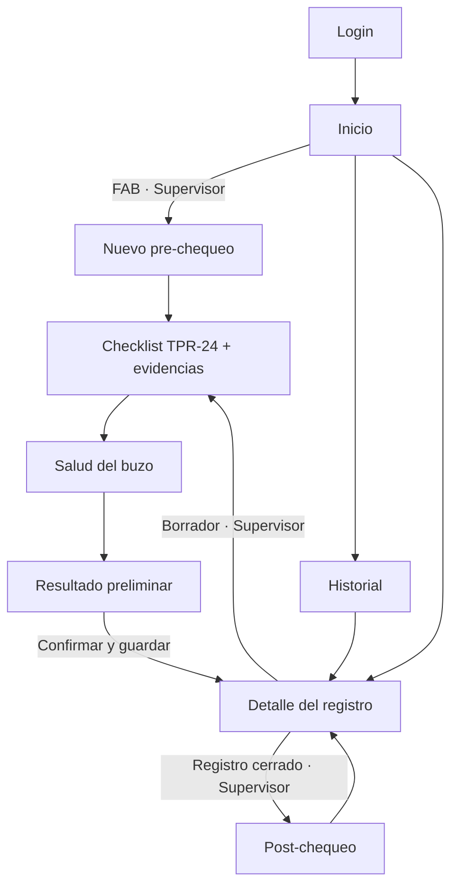
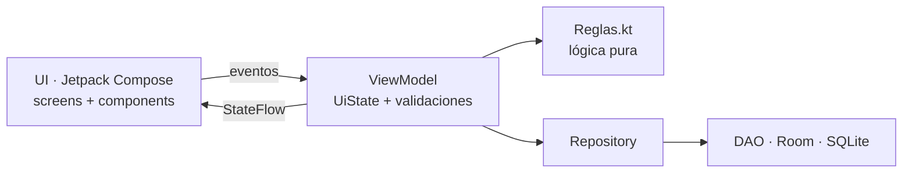
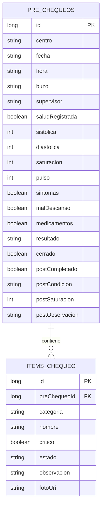

# AquaCheck Buceo


Aplicación Android para **digitalizar el pre-chequeo de seguridad previo a una faena de buceo**, desarrollada para el caso académico **DSY1105 · Desarrollo de Aplicaciones Móviles** (AquaChile · Duoc UC CITT Puerto Montt).

> ⚠️ **MVP académico.** Usa únicamente **datos ficticios**. No emite autorizaciones reales de faena, no entrega diagnósticos médicos y no reemplaza los protocolos ni a los responsables reales del proceso.

---

## Tabla de contenidos

1. [El problema](#1-el-problema)
2. [La solución](#2-la-solución)
3. [Funcionalidades](#3-funcionalidades)
4. [Roles y permisos](#4-roles-y-permisos)
5. [Reglas de negocio](#5-reglas-de-negocio)
6. [Flujo de navegación](#6-flujo-de-navegación)
7. [Arquitectura](#7-arquitectura)
8. [Modelo de datos](#8-modelo-de-datos)
9. [Tecnologías](#9-tecnologías)
10. [Identidad visual](#10-identidad-visual)
11. [Estructura del proyecto](#11-estructura-del-proyecto)
12. [Cómo ejecutarlo](#12-cómo-ejecutarlo)
13. [Usuarios y datos de prueba](#13-usuarios-y-datos-de-prueba)
14. [Pruebas](#14-pruebas)
15. [Generar el APK](#15-generar-el-apk)
16. [Alcance del MVP](#16-alcance-del-mvp)
17. [Desafíos para el equipo](#17-desafíos-para-el-equipo)
18. [Privacidad y confidencialidad](#18-privacidad-y-confidencialidad)
19. [Estado del proyecto](#19-estado-del-proyecto)
20. [Contexto académico](#20-contexto-académico)

---

## 1. El problema

AquaChile realiza cerca de **90 inmersiones diarias**. Antes de cada una se revisa equipamiento, compresores, oxígeno de contingencia, señalización y condiciones del entorno, además de controles preventivos de salud del buzo. Hoy ese proceso sigue siendo **"hoja y lápiz"**: formulario TPR-24, encuestas de salud, bitácoras físicas y fotos que se cargan después a una carpeta compartida.

Consecuencias:

- Registros incompletos o duplicados.
- Pérdida de evidencia y poca trazabilidad.
- Fuerte dependencia del factor humano.
- Detección tardía de condiciones críticas que podrían impedir una faena segura.
- Dificultad para revisar históricos.

## 2. La solución

Una app móvil pensada para **uso en terreno** (interfaz clara, botones grandes, pocos pasos) que guía al supervisor por el pre-chequeo, valida los datos obligatorios, guarda la evidencia fotográfica y entrega un **resultado preliminar con semáforo**. Todo se almacena en el dispositivo, por lo que **funciona sin conexión**.

## 3. Funcionalidades

| # | Funcionalidad | Detalle |
|---|---|---|
| RF01 | Inicio de sesión por rol | Usuarios ficticios; el rol define qué se puede hacer |
| RF02 | Nuevo pre-chequeo | Centro, fecha, hora, buzo y supervisor, con validación de formato |
| RF03 | Checklist TPR-24 | 17 ítems de equipo de buceo intermedio (36 m) agrupados por categoría |
| RF04 | Semáforo por ítem | **OK**, **Obs.**, **No**, **N/A**; observación obligatoria si es Obs. o No |
| RF05 | Evidencia fotográfica | Cámara del sistema o galería, con miniatura en el checklist y el detalle |
| RF06 | Salud ficticia del buzo | Presión, saturación, pulso y encuesta preventiva con semáforo en vivo |
| RF07 | Resultado preliminar | **Cumple · Observado · Requiere revisión**, con lista de alertas |
| RF08 | Guardado e historial | Búsqueda por buzo/centro/fecha y filtro por resultado |
| RF09 | Detalle del registro | Datos, salud, post-chequeo y checklist con evidencias |
| RF10 | Post-chequeo | Condición final del buzo al terminar la inmersión |
| — | Borradores | Un pre-chequeo sin cerrar se puede continuar o eliminar |
| — | Persistencia | Los datos no se pierden al rotar, cambiar de pantalla o cerrar la app |

## 4. Roles y permisos

| Acción | Supervisor de buceo | Jefe de centro / Admin |
|---|:---:|:---:|
| Iniciar sesión | ✅ | ✅ |
| Crear pre-chequeo | ✅ | ❌ |
| Completar checklist, fotos y salud | ✅ | ❌ |
| Confirmar y cerrar el registro | ✅ | ❌ |
| Registrar post-chequeo | ✅ | ❌ |
| Eliminar borradores | ✅ | ❌ |
| Ver historial y detalle | ✅ | ✅ |

## 5. Reglas de negocio

**Resultado preliminar** (`util/Reglas.kt`):

| Condición | Resultado |
|---|---|
| Algún ítem **crítico** en "No cumple" **o** salud en nivel crítico | 🔴 **Requiere revisión** |
| Algún ítem observado / no cumple (no crítico) **o** salud en atención | 🟡 **Observado** |
| Todo cumple o no aplica **y** salud normal | 🟢 **Cumple** |

**Semáforo de salud** (umbrales **ficticios** solo para el ejercicio):

| Nivel | Se activa si… |
|---|---|
| 🔴 Crítico | SpO₂ < 92 %, presión ≥ 160/100, pulso < 45 o > 120, o el buzo declara síntomas |
| 🟡 Atención | SpO₂ < 95 %, presión ≥ 140/90, pulso < 55 o > 100, mal descanso, o alcohol/medicamentos en 24 h |
| 🟢 Normal | Ninguna de las anteriores |

**Validaciones principales**

- Fecha `dd-MM-aaaa` y hora `HH:mm` reales (se rechazan `32-13-2026` o `25:99`).
- No se avanza con ítems pendientes ni con ítems observados sin observación (mín. 5 letras).
- Rangos de salud: sistólica 70–250, diastólica 40–150 (menor que la sistólica), SpO₂ 50–100, pulso 30–220.
- El post-chequeo exige descripción si la condición final no es "Sin novedad".

## 6. Flujo de navegación



## 7. Arquitectura

MVVM simple, sin librerías de inyección de dependencias ni capas innecesarias. **Room es la fuente de verdad**: cada pantalla recibe el `id` del registro por navegación y lo observa desde la base de datos.



Cada ViewModel mantiene un `MutableStateFlow` **privado** y expone un `StateFlow` **de solo lectura**: el estado solo cambia dentro del ViewModel y la pantalla únicamente lo observa.

| ViewModel | Responsabilidad |
|---|---|
| `SesionViewModel` | Login y rol del usuario |
| `HistorialViewModel` | Lista de registros, búsqueda y filtros |
| `PreChequeoViewModel` | Crear, checklist, fotos, salud, resultado, post-chequeo y borrado |

## 8. Modelo de datos



Al borrar un pre-chequeo se eliminan sus ítems (`ON DELETE CASCADE`). Las fotos se guardan en el almacenamiento privado de la app (`filesDir/evidencias`).

## 9. Tecnologías

| Área | Tecnología |
|---|---|
| Lenguaje | Kotlin 2.3 |
| UI | Jetpack Compose + Material 3 |
| Arquitectura | MVVM con `StateFlow` y Coroutines |
| Navegación | Navigation Compose (rutas con argumentos) |
| Persistencia | Room (SQLite) con KSP |
| Imágenes | Coil |
| Cámara / galería | `ActivityResultContracts` + `FileProvider` (sin permiso `CAMERA`) |
| Pruebas | JUnit 4 · Compose UI Test |
| Build | AGP 9.4 · Gradle 9.8 · Catálogo de versiones (`libs.versions.toml`) |
| SDK | `minSdk 26` · `targetSdk 36` · `compileSdk 37` |

Se descartó Retrofit: el caso permite trabajar solo con datos locales. La sincronización queda como [desafío](#17-desafíos-para-el-equipo).

## 10. Identidad visual

| Muestra | Color | HEX | Uso en la app |
|:---:|---|---|---|
|  | Azul profundo | `#0B3D62` | Barras superiores, botones primarios, título de categorías |
|  | Celeste | `#00A3C4` | Acentos, ola del logo y final del degradado de marca |
|  | Fondo | `#F3F7F9` | Fondo de todas las pantallas |
|  | Texto | `#0F2430` | Títulos y cuerpo de texto |
|  | Verde | `#17A75A` | Cumple / estado correcto |
|  | Ámbar | `#D98A00` | Observado / atención |
|  | Rojo | `#DE3B40` | No cumple / crítico / errores |

Los colores del semáforo (verde, ámbar y rojo) solo se usan para comunicar estado, nunca como decoración. El logotipo representa una ola y un check sobre un degradado azul (de la superficie a la profundidad).

## 11. Estructura del proyecto

```text
AquaCheck/
├── README.md · GUIA_PROYECTO.md
├── build.gradle.kts · settings.gradle.kts · gradle.properties
├── gradlew · gradlew.bat · gradle/ (wrapper + libs.versions.toml)
├── keystore.properties.example
└── app/
    ├── build.gradle.kts
    └── src/
        ├── main/
        │   ├── AndroidManifest.xml
        │   ├── res/                    xml/file_paths · values · drawable · mipmap-anydpi-v26
        │   └── java/cl/duoc/aquacheck/
        │       ├── MainActivity.kt · AquaCheckApp.kt
        │       ├── model/              Enums · Usuario · PreChequeo · ItemChequeo
        │       ├── data/
        │       │   ├── local/          Converters · PreChequeoDao · AquaCheckDatabase
        │       │   └── repository/     PreChequeoRepository
        │       ├── viewmodel/          Sesion · Historial · PreChequeo
        │       ├── navigation/         AppNavigation
        │       ├── util/               Reglas · DatosDemo · Almacenamiento
        │       └── ui/
        │           ├── theme/          Theme
        │           ├── components/     Semaforo · AquaTopBar · Formulario · RegistroCard · ItemCard
        │           └── screens/        Login · Inicio · Historial · NuevoPreChequeo · Checklist
        │                               Salud · Resultado · Detalle · PostChequeo
        ├── test/                       ReglasTest · SesionViewModelTest
        └── androidTest/                LoginScreenTest
```

Cada archivo de código empieza con un comentario `// ARCHIVO:` que explica su propósito.

## 12. Cómo ejecutarlo

**Requisitos**

- Android Studio reciente, usando su **JDK embebido** (*Settings → Build Tools → Gradle → Gradle JDK = jbr*).
- Android SDK con la plataforma API 37 (el asistente de Android Studio la descarga).
- Emulador o dispositivo con **Android 8.0 (API 26)** o superior.

**Pasos**

1. Clona el repositorio en una ruta **fuera de OneDrive** (por ejemplo `C:\proyectos\AquaCheck`). OneDrive bloquea los archivos de `build/` y Gradle falla con *"Unable to delete directory"*.
2. Abre la carpeta en Android Studio y espera el *Gradle Sync*.
3. Ejecuta la app (▶) en un emulador o dispositivo.

**Por consola (Windows)**

```text
gradlew assembleDebug
```

> Si tu Android Studio es más antiguo y no acepta la versión de AGP, ajusta `agp` en `gradle/libs.versions.toml` y `distributionUrl` en `gradle/wrapper/gradle-wrapper.properties`.

## 13. Usuarios y datos de prueba

| Usuario | Clave | Rol |
|---|---|---|
| `supervisor` | `1234` | Supervisor de buceo |
| `admin` | `1234` | Jefe de centro / Admin |

Centros: *Centro Demo Calbuco*, *Puerto Montt* y *Chiloé*. Buzos: *Buzo Demo 01* a *04*.

**Escenarios sugeridos para probar la app**

| Escenario | Qué hacer | Resultado esperado |
|---|---|---|
| Pre-chequeo completo | Todo en "OK", presión 120/80, SpO₂ 98, pulso 70 | 🟢 Cumple |
| Ítem observado | Un ítem no crítico en "Obs." con texto | 🟡 Observado |
| Falla crítica | "Oxígeno de contingencia" en "No" | 🔴 Requiere revisión |
| Datos faltantes | Dejar ítems pendientes y pulsar *Continuar* | Snackbar con el error |
| Salud crítica | SpO₂ = 90 | 🔴 Requiere revisión |
| Borrador | Salir a mitad del checklist y volver desde el historial | Se puede continuar o eliminar |
| Rol Admin | Entrar como `admin` | No ve botón de nuevo pre-chequeo ni acciones |

## 14. Pruebas

| Tipo | Archivo | Qué valida |
|---|---|---|
| Unitaria | `ReglasTest` | Validación del formulario, semáforo de salud, reglas del checklist y cálculo del resultado |
| Unitaria | `SesionViewModelTest` | Login correcto e incorrecto |
| UI (Compose) | `LoginScreenTest` | Mensaje de error al ingresar sin datos |

```text
gradlew testDebugUnitTest            # unitarias (7 pruebas)
gradlew connectedDebugAndroidTest    # UI, requiere emulador o dispositivo
```

## 15. Generar el APK

| Tipo | Comando | Ubicación |
|---|---|---|
| Debug | `gradlew assembleDebug` | `app/build/outputs/apk/debug/app-debug.apk` |
| Release | `gradlew assembleRelease` | `app/build/outputs/apk/release/` |

**Firmar el release**

1. Crea la keystore (una sola vez, guárdala **fuera** del repositorio):

   ```text
   keytool -genkeypair -v -keystore aquacheck-release.jks -alias aquacheck -keyalg RSA -keysize 2048 -validity 10000
   ```

2. Copia `keystore.properties.example` como `keystore.properties` y completa tus datos (el archivo está en `.gitignore`).
3. Ejecuta `gradlew assembleRelease`: se genera `app-release.apk` firmado. Sin `keystore.properties` se genera `app-release-unsigned.apk`.

El paso a paso completo está en [`GUIA_PROYECTO.md`](GUIA_PROYECTO.md).

## 16. Alcance del MVP

**Incluido (≈ 80 % del problema):** login por rol, nuevo pre-chequeo, checklist con semáforo y observaciones, evidencias, salud ficticia, resultado preliminar, historial con búsqueda y filtros, detalle, post-chequeo, persistencia local y pruebas básicas.

**Fuera de alcance** (queda para etapas futuras, según lo acordado con el cliente):

- Reconocimiento automático de equipamiento mediante IA en las fotografías.
- Integración con el dispositivo **Census** y otros sensores.
- Sincronización con OneDrive u otros sistemas corporativos de AquaChile.
- Algoritmos predictivos basados en el historial de salud y desempeño de los buzos.

## 17. Desafíos para el equipo

El 20 % restante lo completa cada equipo. Elijan al menos 5:

1. **Identidad propia:** logo del equipo, tipografía y modo oscuro.
2. **Filtros avanzados:** por centro, fecha (`DatePicker`) y rango de fechas.
3. **Salud ampliada:** glicemia o temperatura con sus reglas y validaciones.
4. **Firma simulada** del supervisor al confirmar (dibujo en `Canvas`).
5. **Exportar** el registro a PDF o compartirlo con `Intent.ACTION_SEND`.
6. **Sincronización simulada** con una API REST ficticia usando Retrofit y una marca "pendiente de sincronizar".
7. **Dashboard** con gráfico de resultados por semana.
8. **Más pruebas:** `PreChequeoViewModel` con base de datos en memoria y pruebas de la pantalla del checklist.

## 18. Privacidad y confidencialidad

- Todos los datos de la app son **ficticios, simulados o anonimizados**.
- No publiques información interna de AquaChile en repositorios, capturas, videos ni presentaciones.
- La carpeta `contexto/` (material entregado por el cliente, con datos personales y documentos internos) **no debe subirse** al repositorio; está excluida en `.gitignore`.
- No subas `keystore.properties` ni archivos `.jks`.

## 19. Estado del proyecto

Verificado con **AGP 9.4.1 · Gradle 9.8.1 · Kotlin 2.3.0**:

- ✅ `assembleDebug` y `assembleRelease` compilan.
- ✅ 7 pruebas unitarias en verde.
- ✅ La prueba de UI compila (se ejecuta en emulador).
- ⏳ El recorrido visual completo en emulador o dispositivo aún no se ha ejecutado: pruébalo y reporta cualquier detalle.

## 20. Contexto académico

Proyecto base de la asignatura **DSY1105 — Desarrollo de Aplicaciones Móviles**, Duoc UC · Escuela de Informática y Telecomunicaciones · CITT. Está pensado para todo el curso: cada equipo parte de esta solución, la reconstruye con la guía y completa el 20 % restante con sus propias mejoras.
